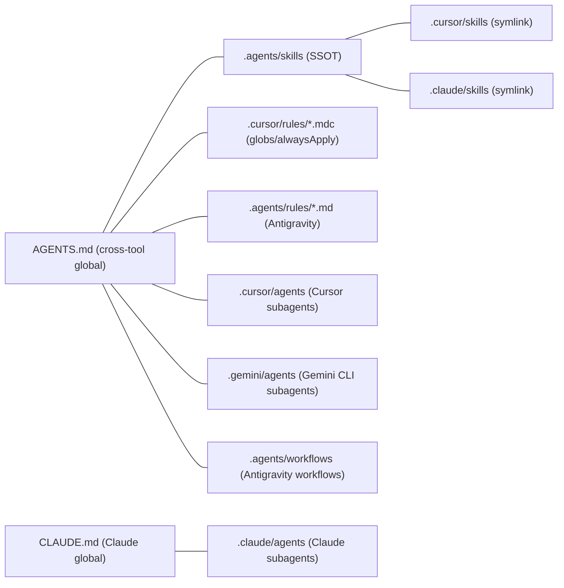

# 건기식 비교 플랫폼 AI Harness 재정립 계획

## 0. 전체 방향성

- **단일 진실 원천(SSOT):** PRD v1.0 ([docs/00_PRD_v1_0.md](docs/00_PRD_v1_0.md)) + SRS v1.4 ([docs/05_SRS_v1.md](docs/05_SRS_v1.md))
- **확정 스택 (SRS 1.2.3 CON-7~13):** Next.js (App Router) + TypeScript + Prisma + Supabase(PostgreSQL/Auth/Storage) + Tailwind + shadcn/ui + Vercel(Hosting/Cron/KV/Analytics) + Resend(Email) + Mixpanel/Amplitude(Analytics) + Vercel AI SDK + Google Gemini API(인프라만 사전 셋업)
- **하네스 표준 (README 가이드 준수):**
  - 콘텐츠 중앙화: `AGENTS.md` + `.agents/skills/` 가 SSOT, 각 도구는 symlink 로 참조
  - 행동 분산화: Cursor/Claude/Gemini 별 특수 기능(globs, hooks, fork context, tool 권한)은 도구별 전용 폴더에서 관리
- **선택 사항 (사용자 확정):**
  - 기존 stack 불일치 샘플 파일은 **완전 삭제** 후 재구성
  - Subagents 는 **최소 구성** (Claude 3개 + Cursor/Gemini 각 1-2개) 으로 두고, 나머지 도메인 지식은 Skills 로 흡수

## 1. 기존 파일 처리 (Cleanup)

### 1-1. 완전 삭제 (스택 불일치)

- `.cursor/skills/` 하위 13개 폴더 (Java/Spring/Gradle/JPA/QueryDSL/Kafka/Flutter/FastAPI/MySQL/Lettuce-Redisson/React-Vite/Three-Tier/Swagger-Spring):
  - `300-java-spring-cursor-rules/`, `301-gradle-groovy-rules/`, `302-jpa-querydsl-dynamic-query-rules/`, `302-python-fastapi-rules/`, `303-database-mysql-jpa-rules/`, `303-spring-redis-lettuce-redisson-rules/`, `304-api-rest-design-rules/`, `304-kafka-data-pipeline-rules/`, `305-api-swagger-testing-rules/`, `305-kafka-msa-saga-pattern-rules/`, `306-react-vite-tailwind-rules/`, `306-three-tier-architecture-rules/`, `307-flutter-riverpod-supabase-ai-rules/`
- `.claude/agents/` 8개: `flutter-app.md`, `gradle.md`, `java-spring.md`, `jpa-querydsl.md`, `kafka-pipeline.md`, `kafka-saga.md`, `react-frontend.md`, `spring-redis.md`
- `.claude/commands/` 3개: `fix-error.md`, `gitflow-commit.md`, `setup-env.md` (Claude 4.x 스펙상 Skills 로 통합)

### 1-2. 유지 또는 재작성 (범용)

- 유지·재작성: `.cursor/skills/100-error-fixing-process/`, `101-build-and-env-setup/` (Next.js/Vercel 절차로 재작성), `102-gitflow-agent/`, `200-git-commit-push-pr/`, `201-code-commenting/`, `202-github-issue-handling/`, `generate-cursor-rule/`, `generate-tasks-from-srs/`
- 유지: `.cursor/agents/document-updater.md`, `.gemini/agents/readme-architect.md`, `.agents/workflows/generate-tasks-from-srs.md`, `.agents/workflows/generate-agent-rule.md`

## 2. 디렉토리 토폴로지 (Symlink 표준화)

Common Harness 가이드 (`README-common-harness.md` §1.2) 권장 구조로 정렬한다. 현재 `.agents/skills -> ../.cursor/skills` 인 역방향 심볼릭을 SSOT 가 `.agents/skills/` 가 되도록 뒤집는다.

작업 절차:
1. 기존 `.agents/skills` 심볼릭 해제
2. `.cursor/skills/*` → `.agents/skills/*` 로 이동 (정리 후)
3. `ln -s ../.agents/skills .cursor/skills` 재설정
4. `ln -s ../.agents/skills .claude/skills` 신규 설정

## 3. 새/재작성 산출물

### 3-1. 글로벌 최상위 규칙

- [AGENTS.md](AGENTS.md) — **전면 재작성**: 프로젝트 비전(건기식 비교 플랫폼), 페르소나(C1/C2/A2/E2), 확정 스택(Next.js+Prisma+Supabase+Vercel), 핵심 제약(CON-1~13), NFR 임계치, 도구 라우팅 인덱스
- [CLAUDE.md](CLAUDE.md) — **전면 재작성**: AGENTS.md 와 중복 최소화하고, Claude 전용 Subagent 라우팅(`nextjs-fullstack`, `prisma-supabase`, `external-api-integration`, `document-updater`) 만 명시
- `.cursor/rules/001-project-overview.mdc` (alwaysApply: true) — PRD 1절 비전·페르소나·KPI 요약
- `.cursor/rules/002-tech-stack.mdc` (alwaysApply: true) — SRS 1.2.3 CON-7~13 스택 고정
- `.cursor/rules/003-development-guidelines.mdc` (alwaysApply: true) — 코드 스타일, 보안(TLS/k-anonymity/금지 표현), 성능 SLA(LCP≤2.5s, 단가API p95≤3.5s, 뱃지 p95≤1s)
- `.cursor/rules/004-mfds-compliance.mdc` (`globs: app/**/*badge*, app/**/*ingredient*`) — 식약처 공전 1:1 매칭, 질병 예방·치료 표현 0건
- `.agents/rules/001-project-overview.md`, `002-tech-stack.md`, `003-development-guidelines.md` — Cursor mdc 와 1:1 동기 (Antigravity 호환 마크다운)

### 3-2. Skills (`.agents/skills/` 가 SSOT, 0번대 generic / 100-200번대 process / 300번대 stack)

유지·재작성 (범용 8건):
- `100-error-fixing-process/SKILL.md` (그대로)
- `101-build-and-env-setup/SKILL.md` → Next.js / Vercel / Supabase / Prisma 절차로 재작성, `.env.local` 키 목록(`NEXT_PUBLIC_SUPABASE_URL`, `SUPABASE_SERVICE_ROLE_KEY`, `COUPANG_ACCESS_KEY`, `COUPANG_SECRET_KEY`, `MFDS_API_KEY`, `KAKAO_JS_KEY`, `RESEND_API_KEY`, `MIXPANEL_TOKEN`, `KV_*`, `GEMINI_API_KEY`) 정의
- `102-gitflow-agent/SKILL.md`, `200-git-commit-push-pr/SKILL.md`, `201-code-commenting/SKILL.md`, `202-github-issue-handling/SKILL.md` (그대로)
- `generate-cursor-rule/SKILL.md`, `generate-tasks-from-srs/SKILL.md` (그대로)

신규 스택 스킬 (10건, 모두 `.agents/skills/` 에 작성):
- `300-nextjs-app-router-rules/SKILL.md` — App Router 구조(`app/(public)`, `app/(auth)`, `app/api/v1/*`, `app/actions/*`), Server vs Client Components, `revalidate`/`unstable_cache`, 동적/정적 라우팅
- `301-typescript-strict-rules/SKILL.md` — `strict: true`, `noUncheckedIndexedAccess`, Zod 스키마 검증, error narrowing, never returning untyped any
- `302-prisma-supabase-rules/SKILL.md` — `schema.prisma` (PRODUCT/INGREDIENT/PRICE_SNAPSHOT/BADGE/LABEL_ARCHIVE/ERROR_REPORT/USER), migration 절차, Supabase Auth(`@supabase/ssr`), Storage(라벨 이미지), RLS 정책
- `303-tailwind-shadcn-ui-rules/SKILL.md` — Tailwind v3 + shadcn/ui 설치/추가, 디자인 토큰, 다크모드, a11y(WCAG AA), 모바일 퍼스트, 카카오 내장 브라우저 호환
- `304-route-handler-server-action-rules/SKILL.md` — `GET /api/v1/compare`, `/api/v1/badges`, `/api/v1/search` Route Handler 패턴; `POST` 는 Server Actions(`"use server"`), Zod 검증, 에러 핸들링(`Result<T,E>`), 응답 envelope, 카메라이션 응답 시간 SLA 명시
- `305-vercel-deploy-cron-kv-rules/SKILL.md` — `vercel.json`(crons: 일1회 price sync, 주1회 카카오 정책 감지), Edge Functions, KV Cache TTL(뱃지 24h), Log Drain → Slack, `vercel link/env pull`
- `306-coupang-mfds-kakao-integration-rules/SKILL.md` — `lib/adapters/*` 전략 패턴(REQ-NF-024 충족), `CoupangAdapter`/`MFDSAdapter`/`KakaoLinkAdapter`, Rate Limit/타임아웃/Retry, 폴백(`PRICE_SNAPSHOT` 캐시), CP-1·CP-2 비상 절차
- `307-mfds-compliance-prohibited-expression-rules/SKILL.md` — 식약처 공전 1:1 매칭 강제, 질병 예방·치료 금지 표현 lint 룰(빌드 시 검수), 뱃지 텍스트 화이트리스트, 미등재 원료 회색 라벨 처리
- `308-mixpanel-analytics-rules/SKILL.md` — 이벤트 네이밍(`page_view`, `search`, `calc_result_view`, `affiliate_link_click`, `kakao_share_send`, `shared_landing_view`, `error_report_submit`), UTM 파라미터 표준, K-Factor/CTR/펀널 산출 정의
- `309-mobile-web-performance-a11y-rules/SKILL.md` — LCP ≤ 2.5s, 단가 비교 p95 ≤ 3.5s, 뱃지 p95 ≤ 1s, 출처 아코디언 p95 ≤ 500ms, 이미지 최적화(next/image + Supabase Storage), prefetch/lazy, 키보드 접근성

### 3-3. Subagents (사용자 확정: 최소 구성)

`.claude/agents/`:
- `nextjs-fullstack.md` — Next.js App Router + Route Handlers + Server Actions + shadcn/ui + Tailwind. Skills 주입: `300, 301, 303, 304, 309`
- `prisma-supabase.md` — Prisma 스키마/마이그레이션/시드, Supabase Auth/Storage/RLS. Skills 주입: `301, 302`
- `external-api-integration.md` — Coupang Partners / MFDS / 카카오 Link / Resend / Mixpanel 어댑터 구현 및 폴백. Skills 주입: `301, 304, 306, 307, 308`
- `document-updater.md` — 기존 `.cursor/agents/document-updater.md` 의 Claude 호환 버전 사본 (README/AGENTS.md/CLAUDE.md/docs 동기 업데이트)

`.cursor/agents/`:
- `document-updater.md` (그대로 유지)
- `mfds-compliance-auditor.md` (신규) — 식약처 공전 1:1 매칭 + 금지 표현 검수 전용

`.gemini/agents/` (Hub-and-Spoke, `model: inherit` 필수):
- `readme-architect.md` (그대로)
- `security-auditor.md` (신규) — TLS, k-anonymity ≥ 5, OWASP, `.env` 누출, RLS 점검 — `tools: [read_file, glob]` 만 부여
- `compliance-checker.md` (신규) — 건강기능식품법 금지 표현, 뱃지 텍스트 검수

### 3-4. Slash Commands → Skills 통합 (Claude)

README-claude-harness.md §2.2 에 따라 `.claude/commands/` 는 deprecation 상태. 모두 `.agents/skills/` 의 동등 스킬로 흡수:
- `fix-error.md` → `.agents/skills/100-error-fixing-process/SKILL.md` (이미 존재, 인수 처리 가이드 보강)
- `setup-env.md` → `.agents/skills/101-build-and-env-setup/SKILL.md` (위에서 Next.js 절차로 재작성)
- `gitflow-commit.md` → `.agents/skills/102-gitflow-agent/SKILL.md` (이미 존재, draft PR 단계 보강)

### 3-5. Workflows (Antigravity)

- `.agents/workflows/generate-agent-rule.md` (그대로)
- `.agents/workflows/generate-tasks-from-srs.md` (그대로)
- `.agents/workflows/release-readiness-checklist.md` (신규) — Closed Beta 1/2 → Public Launch 체크리스트 (SRS 6.4.1), 부하 점검, Lighthouse, MFDS 금지 표현 검수, k-anonymity 점검
- `.agents/workflows/h1-h5-experiment-instrumentation.md` (신규) — H1~H5 가설별 Mixpanel 이벤트·UTM·코호트 셋업 절차 (PRD 8-3, SRS 6.4.2)

## 4. 핵심 변경 요지 - PRD/SRS ↔ Harness 매핑

- F1 Super-Calc → `nextjs-fullstack` + Skill `304, 306, 309` + REQ-NF-001 (p95 ≤ 3.5s)
- F2 Anti-BS Badge → `nextjs-fullstack` + Skill `307` (식약처 1:1, 금지 표현 0건) + `mfds-compliance-auditor` 서브에이전트
- F3 Viral Engine (카카오) → Skill `306` (CP-2 폴백) + Skill `308` (`kakao_share_send`)
- F4 Data Trust (오류 제보 48h SLA) → `prisma-supabase` + Server Actions Skill `304` + Resend 알림 (Skill `306`)
- 모니터링 / KPI (PRD 5-4, SRS REQ-NF-021~023) → Skill `308` + `release-readiness-checklist`
- 외부 시스템 폴백 (SRS 3.1.1) → Skill `306` 의 어댑터 전략 패턴 (REQ-NF-024 충족)

## 5. 실행 시 사용자 확인 필요 항목

- 없음. 위 결정만으로 실행 가능. (Hook 자동화·CI 게이트는 의도적으로 1차 범위에서 제외 — 후속 단계에서 추가)
