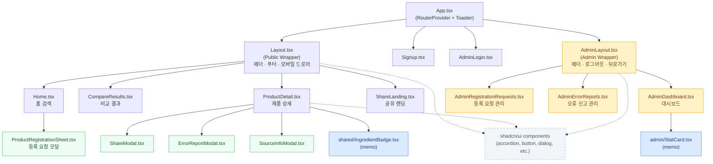

# COMPONENT_STRUCTURE.md — 개선된 컴포넌트 구조

> 리팩토링 완료 후의 현행 컴포넌트 트리 및 파일 구조를 정의합니다.

---

## 1. 전체 컴포넌트 트리



---

## 2. 파일 구조 요약

```
src/
├── app/
│   ├── App.tsx                         # 루트: RouterProvider + Toaster
│   ├── routes.ts                       # 라우팅 정의 (Public / Admin 중첩 구조)
│   │
│   ├── components/
│   │   ├── Layout.tsx                  # 공용 레이아웃 (헤더, 푸터, 드로어)
│   │   ├── AdminLayout.tsx             # 어드민 전용 레이아웃 (헤더, 뒤로가기)
│   │   │
│   │   ├── Home.tsx                    # 메인 검색 화면
│   │   ├── CompareResults.tsx          # 검색 결과 비교 화면
│   │   ├── ProductDetail.tsx           # 제품 상세 화면
│   │   ├── ShareLanding.tsx            # 공유 링크 랜딩
│   │   ├── Signup.tsx                  # 회원가입
│   │   ├── AdminLogin.tsx              # 어드민 로그인
│   │   ├── AdminDashboard.tsx          # 어드민 대시보드
│   │   ├── AdminRegistrationRequests.tsx
│   │   ├── AdminErrorReports.tsx
│   │   │
│   │   ├── ShareModal.tsx              # 공유 모달
│   │   ├── ErrorReportModal.tsx        # 오류 신고 모달
│   │   ├── SourceInfoModal.tsx         # 데이터 출처 모달 (분리됨)
│   │   ├── ProductRegistrationSheet.tsx
│   │   │
│   │   ├── shared/
│   │   │   └── IngredientBadge.tsx     # 공용 배지 (React.memo)
│   │   ├── admin/
│   │   │   └── StatCard.tsx            # 어드민 통계 카드 (React.memo)
│   │   ├── figma/
│   │   │   └── ImageWithFallback.tsx
│   │   └── ui/                         # shadcn/ui 원시 컴포넌트 모음
│   │
│   ├── constants/
│   │   └── index.ts                    # BADGE_CONFIG, ERROR_TYPE_MAP
│   │
│   ├── data/
│   │   └── mock.ts                     # MOCK_PRODUCT, MOCK_REQUESTS, MOCK_REPORTS
│   │
│   ├── hooks/
│   │   ├── useModal.ts                 # 모달 상태 관리 훅
│   │   └── useDebounce.ts              # 입력 지연 처리 훅
│   │
│   └── types/
│       └── index.ts                    # 전역 TypeScript 타입 정의
│
└── styles/                             # 전역 CSS 및 Tailwind 설정
```

---

## 3. 의존성 흐름 요약

| 레이어 | 파일 위치 | 의존 방향 |
|--------|-----------|-----------|
| **Types** | `types/index.ts` | 없음 (최하위) |
| **Constants** | `constants/index.ts` | `types` 참조 |
| **Mock Data** | `data/mock.ts` | `types` 참조 |
| **Hooks** | `hooks/` | React 내장 훅만 의존 |
| **Shared UI** | `components/shared/`, `components/admin/` | `types`, `constants`, `hooks` |
| **Page Components** | `components/*.tsx` | `shared/`, `data/`, `hooks/` |
| **Layout** | `Layout.tsx`, `AdminLayout.tsx` | Page Components (Outlet) |
| **App / Routes** | `App.tsx`, `routes.ts` | 모든 컴포넌트 |

> 하위 레이어가 상위 레이어를 참조하는 역방향 의존은 존재하지 않습니다.
