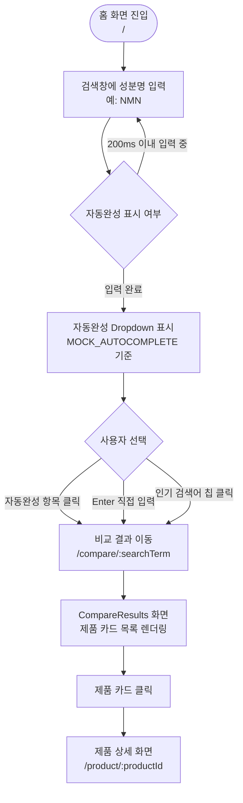
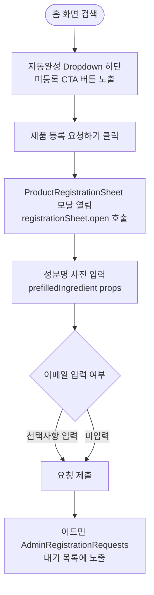
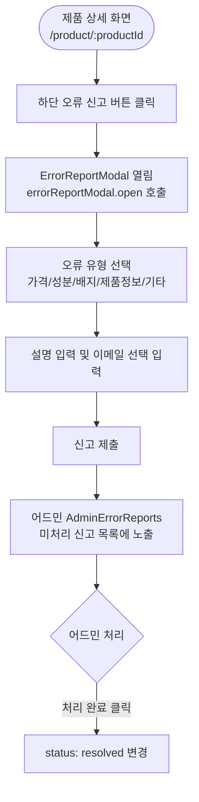
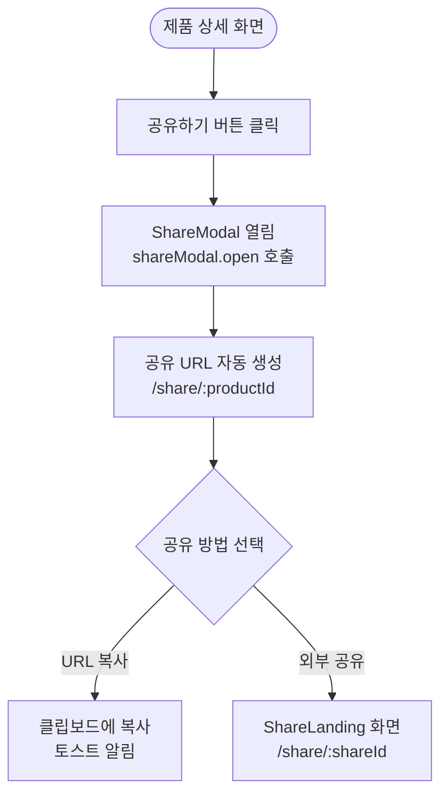
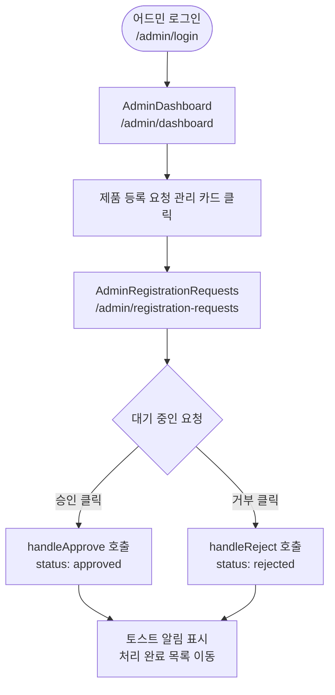
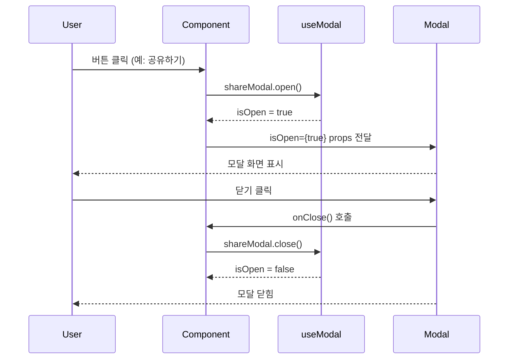

# UX_FLOW.md — Super-Calc 핵심 UX 시나리오

> 본 문서는 Super-Calc 프로토타입의 주요 사용자 경험 흐름을 정의합니다.
> 각 시나리오는 사용자 목표 → 진입점 → 인터랙션 흐름 → 결과 순으로 기술합니다.

---

## 시나리오 1. 영양제 성분 검색 → 비교 결과 확인

**사용자 목표**: 특정 성분의 가장 저렴한 영양제를 1일 단가 기준으로 파악한다.

**주요 인터랙션**
- `useDebounce(200ms)` 적용으로 타이핑 중 불필요한 API 호출 방지
- 인기 검색어 칩(Quick Search Chip)을 통해 탐색 진입점을 낮춤
- 검색창 포커스 해제 시 자동완성 Dropdown 자동 닫힘

---

## 시나리오 2. 미등록 제품 등록 요청

**사용자 목표**: 찾는 성분이 없을 때 직접 등록 요청을 제출한다.

**주요 인터랙션**
- 사용자가 검색한 쿼리가 `prefilledIngredient`로 모달에 자동 주입됨
- 이메일은 선택 사항 (미제공 → 어드민 화면에서 "미제공" 표시)

---

## 시나리오 3. 제품 상세 확인 → 오류 신고

**사용자 목표**: 제품 정보의 오류를 발견하고 신고한다.

**주요 인터랙션**
- `ErrorReportModal`은 `productName`, `productId`를 props로 받아 신고 맥락 자동 완성
- 신고 유형은 `ERROR_TYPE_MAP` 상수(constants/index.ts)로 중앙 관리

---

## 시나리오 4. 제품 상세 → 공유

**사용자 목표**: 특정 제품 정보를 지인에게 공유한다.

---

## 시나리오 5. 어드민 — 등록 요청 처리

**사용자 목표**: 사용자가 요청한 미등록 제품을 검토하고 승인 또는 거부한다.

---

## 모달 상태 관리 공통 패턴

모든 모달은 `useModal` 훅의 반환값(`isOpen`, `open`, `close`)을 통해 제어됩니다.

