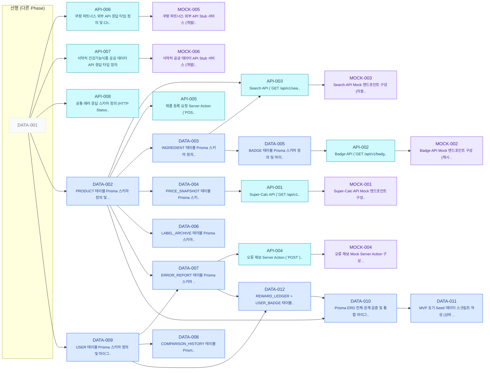
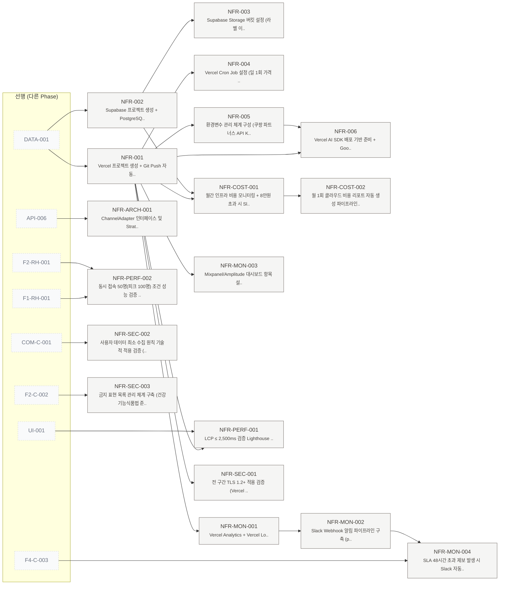
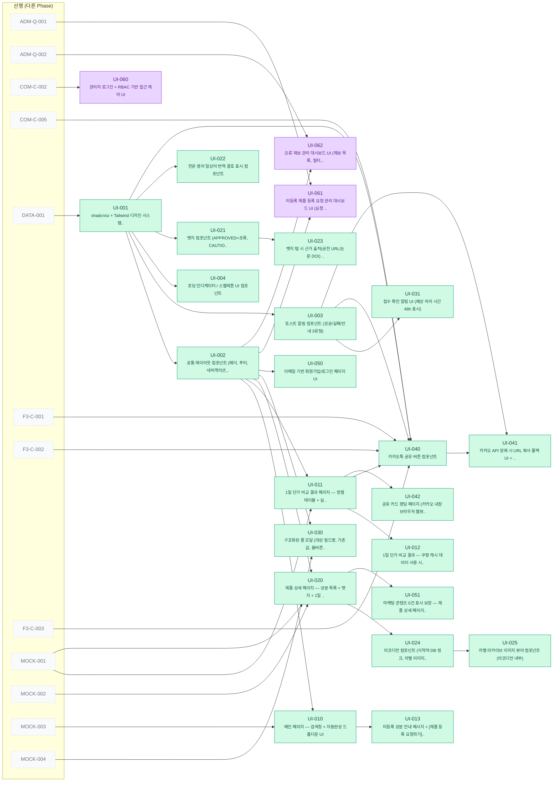

# 📐 TASK 의존성 상세 다이어그램 (Per-Task Granularity)

**Document ID:** TASK-DIAG-001  
**Revision:** 1.1  
**Date:** 2026-04-20  
**기반 문서:** [`06_TASK_LIST_v1.md`](./06_TASK_LIST_v1.md) v1.1 (138개 태스크)  

> 본 문서는 `06_TASK_LIST_v1.md` §9의 Phase 단위 추상 다이어그램을 보완하여, **개별 138개 TASK를 모두 노드로 표현**한 상세 의존성 그래프를 제공한다. 화살표 `A --> B`는 "A가 완료되어야 B를 시작할 수 있음"을 의미한다.

> **v1.1 Changelog (2026-04-20)**
> - 신규 노드 1건: `DATA-012`(REWARD_LEDGER + USER_BADGE 스키마)
> - 신규 엣지 6건: `DATA-007 → DATA-012`, `DATA-009 → DATA-012`, `DATA-012 → DATA-010`, `DATA-012 → F4-C-005`, `F4-C-004 → F4-C-005`, `COM-C-002 → F4-C-005`
> - Phase 1 노드 수 24 → 25, 총 노드 137 → 138, 총 엣지 187 → 193
> - §4.2 Hub 분석: `F4-C-005` fan-in 1→4, `COM-C-002` fan-out 증가 반영

---

## 1. 범례 (Legend)

### 1.1 Epic별 색상 코드

| Epic | 색상 | 클래스 |
|---|---|---|
| E-INFRA (인프라 스캐폴딩) | ⬜ 회색 | `cInfra` |
| E-DATA (DB 스키마) | 🟦 파랑 | `cData` |
| E-API (API 계약/DTO) | 🟦 시안 | `cApi` |
| E-MOCK (Mock/Stub) | 🟪 보라 | `cMock` |
| E-F1 (Super-Calc Engine) | 🟧 주황 | `cF1` |
| E-F2 (Anti-BS Dashboard) | 🟥 빨강 | `cF2` |
| E-F3 (Viral Engine) | 🟪 분홍 | `cF3` |
| E-F4 (Data Trust System) | 🟨 노랑 | `cF4` |
| E-COMMON (공통 기능) | 🟩 청록 | `cCommon` |
| E-ADMIN (관리자 백오피스) | 🟪 진보라 | `cAdmin` |
| E-NFR (비기능) | 🟫 갈색 | `cNfr` |
| E-UI (프론트엔드) | 🟩 초록 | `cUi` |
| E-TEST (테스트 자동화) | ⬜ 연회색 | `cTest` |

### 1.2 Phase 흐름

```
Phase 0 → Phase 1 → Phase 2 → Phase 3/4/5 (병렬) → Phase 6 (Should/Could)
```

---

## 2. 전체 통합 의존성 다이어그램 (138개 노드)

> 모든 태스크와 의존 관계를 단일 그래프로 표현. Phase별 subgraph로 시각적 그룹핑.

```mermaid
flowchart TB
    subgraph P0["Phase 0 — 인프라 스캐폴딩"]
        direction TB
        DATA_001["DATA-001"]
    end

    subgraph P1["Phase 1 — 데이터·계약 (SSOT)"]
        direction TB
        API_001["API-001"]
        API_002["API-002"]
        API_003["API-003"]
        API_004["API-004"]
        API_005["API-005"]
        API_006["API-006"]
        API_007["API-007"]
        API_008["API-008"]
        DATA_002["DATA-002"]
        DATA_003["DATA-003"]
        DATA_004["DATA-004"]
        DATA_005["DATA-005"]
        DATA_006["DATA-006"]
        DATA_007["DATA-007"]
        DATA_008["DATA-008"]
        DATA_009["DATA-009"]
        DATA_010["DATA-010"]
        DATA_011["DATA-011"]
        DATA_012["DATA-012"]
        MOCK_001["MOCK-001"]
        MOCK_002["MOCK-002"]
        MOCK_003["MOCK-003"]
        MOCK_004["MOCK-004"]
        MOCK_005["MOCK-005"]
        MOCK_006["MOCK-006"]
    end

    subgraph P2["Phase 2 — 핵심 로직 (CQRS)"]
        direction TB
        ADM_C_001["ADM-C-001"]
        ADM_C_002["ADM-C-002"]
        ADM_Q_001["ADM-Q-001"]
        ADM_Q_002["ADM-Q-002"]
        COM_C_001["COM-C-001"]
        COM_C_002["COM-C-002"]
        COM_C_003["COM-C-003"]
        COM_C_004["COM-C-004"]
        COM_C_005["COM-C-005"]
        COM_Q_001["COM-Q-001"]
        COM_Q_002["COM-Q-002"]
        COM_RH_001["COM-RH-001"]
        CRON_001["CRON-001"]
        F1_C_001["F1-C-001"]
        F1_C_002["F1-C-002"]
        F1_C_003["F1-C-003"]
        F1_C_004["F1-C-004"]
        F1_Q_001["F1-Q-001"]
        F1_Q_002["F1-Q-002"]
        F1_RH_001["F1-RH-001"]
        F2_C_001["F2-C-001"]
        F2_C_002["F2-C-002"]
        F2_C_003["F2-C-003"]
        F2_C_004["F2-C-004"]
        F2_C_005["F2-C-005"]
        F2_Q_001["F2-Q-001"]
        F2_Q_002["F2-Q-002"]
        F2_RH_001["F2-RH-001"]
        F3_C_001["F3-C-001"]
        F3_C_002["F3-C-002"]
        F3_C_003["F3-C-003"]
        F3_Q_001["F3-Q-001"]
        F4_C_001["F4-C-001"]
        F4_C_002["F4-C-002"]
        F4_C_003["F4-C-003"]
        F4_C_004["F4-C-004"]
        F4_C_005["F4-C-005"]
        F4_Q_001["F4-Q-001"]
        F4_Q_002["F4-Q-002"]
    end

    subgraph P3["Phase 3 — 테스트 자동화"]
        direction TB
        TEST_COM_001["TEST-COM-001"]
        TEST_COM_002["TEST-COM-002"]
        TEST_COM_003["TEST-COM-003"]
        TEST_F1_001["TEST-F1-001"]
        TEST_F1_002["TEST-F1-002"]
        TEST_F1_003["TEST-F1-003"]
        TEST_F1_004["TEST-F1-004"]
        TEST_F1_005["TEST-F1-005"]
        TEST_F1_006["TEST-F1-006"]
        TEST_F2_001["TEST-F2-001"]
        TEST_F2_002["TEST-F2-002"]
        TEST_F2_003["TEST-F2-003"]
        TEST_F2_004["TEST-F2-004"]
        TEST_F2_005["TEST-F2-005"]
        TEST_F2_006["TEST-F2-006"]
        TEST_F3_001["TEST-F3-001"]
        TEST_F3_002["TEST-F3-002"]
        TEST_F3_003["TEST-F3-003"]
        TEST_F4_001["TEST-F4-001"]
        TEST_F4_002["TEST-F4-002"]
        TEST_F4_003["TEST-F4-003"]
        TEST_F4_004["TEST-F4-004"]
        TEST_F4_005["TEST-F4-005"]
        TEST_F4_006["TEST-F4-006"]
    end

    subgraph P4["Phase 4 — 비기능·인프라·보안"]
        direction TB
        NFR_001["NFR-001"]
        NFR_002["NFR-002"]
        NFR_003["NFR-003"]
        NFR_004["NFR-004"]
        NFR_005["NFR-005"]
        NFR_006["NFR-006"]
        NFR_ARCH_001["NFR-ARCH-001"]
        NFR_COST_001["NFR-COST-001"]
        NFR_COST_002["NFR-COST-002"]
        NFR_MON_001["NFR-MON-001"]
        NFR_MON_002["NFR-MON-002"]
        NFR_MON_003["NFR-MON-003"]
        NFR_MON_004["NFR-MON-004"]
        NFR_PERF_001["NFR-PERF-001"]
        NFR_PERF_002["NFR-PERF-002"]
        NFR_SEC_001["NFR-SEC-001"]
        NFR_SEC_002["NFR-SEC-002"]
        NFR_SEC_003["NFR-SEC-003"]
    end

    subgraph P5["Phase 5 — UI/UX 프론트엔드"]
        direction TB
        UI_001["UI-001"]
        UI_002["UI-002"]
        UI_003["UI-003"]
        UI_004["UI-004"]
        UI_010["UI-010"]
        UI_011["UI-011"]
        UI_012["UI-012"]
        UI_013["UI-013"]
        UI_020["UI-020"]
        UI_021["UI-021"]
        UI_022["UI-022"]
        UI_023["UI-023"]
        UI_024["UI-024"]
        UI_025["UI-025"]
        UI_030["UI-030"]
        UI_031["UI-031"]
        UI_040["UI-040"]
        UI_041["UI-041"]
        UI_042["UI-042"]
        UI_050["UI-050"]
        UI_051["UI-051"]
        UI_060["UI-060"]
        UI_061["UI-061"]
        UI_062["UI-062"]
    end

    subgraph P6["Phase 6 — 부록 (Should/Could)"]
        direction TB
        P2_001["P2-001"]
        P2_002["P2-002"]
        P2_003["P2-003"]
        P2_004["P2-004"]
        P2_005["P2-005"]
        P2_006["P2-006"]
        P2_007["P2-007"]
    end

    %% --- Dependency edges ---
    ADM_Q_001 --> ADM_C_001
    ADM_Q_002 --> ADM_C_002
    F4_C_003 --> ADM_C_002
    COM_C_003 --> ADM_Q_001
    F4_C_001 --> ADM_Q_002
    DATA_004 --> API_001
    DATA_005 --> API_002
    DATA_002 --> API_003
    DATA_003 --> API_003
    DATA_007 --> API_004
    DATA_002 --> API_005
    DATA_001 --> API_006
    DATA_001 --> API_007
    DATA_001 --> API_008
    DATA_009 --> COM_C_001
    COM_C_001 --> COM_C_002
    API_005 --> COM_C_003
    DATA_002 --> COM_C_003
    DATA_001 --> COM_C_004
    DATA_001 --> COM_C_005
    API_003 --> COM_Q_001
    DATA_002 --> COM_Q_001
    DATA_003 --> COM_Q_001
    COM_Q_001 --> COM_Q_002
    COM_Q_001 --> COM_RH_001
    COM_Q_002 --> COM_RH_001
    F1_Q_001 --> CRON_001
    F1_C_004 --> CRON_001
    NFR_001 --> CRON_001
    DATA_001 --> DATA_002
    DATA_002 --> DATA_003
    DATA_002 --> DATA_004
    DATA_003 --> DATA_005
    DATA_002 --> DATA_006
    DATA_002 --> DATA_007
    DATA_009 --> DATA_007
    DATA_009 --> DATA_008
    DATA_001 --> DATA_009
    DATA_007 --> DATA_012
    DATA_009 --> DATA_012
    DATA_002 --> DATA_010
    DATA_012 --> DATA_010
    DATA_010 --> DATA_011
    API_001 --> F1_C_001
    DATA_004 --> F1_C_001
    F1_C_001 --> F1_C_002
    F1_C_001 --> F1_C_003
    F1_C_001 --> F1_C_004
    DATA_004 --> F1_C_004
    API_006 --> F1_Q_001
    MOCK_005 --> F1_Q_001
    F1_Q_001 --> F1_Q_002
    DATA_004 --> F1_Q_002
    F1_Q_001 --> F1_RH_001
    F1_Q_002 --> F1_RH_001
    F1_C_001 --> F1_RH_001
    F1_C_004 --> F1_RH_001
    F2_Q_001 --> F2_C_001
    F2_Q_002 --> F2_C_001
    DATA_005 --> F2_C_001
    F2_C_002 --> F2_C_001
    DATA_001 --> F2_C_002
    DATA_003 --> F2_C_003
    F2_C_001 --> F2_C_004
    F2_C_001 --> F2_C_005
    DATA_003 --> F2_Q_001
    API_007 --> F2_Q_002
    MOCK_006 --> F2_Q_002
    F2_Q_001 --> F2_RH_001
    F2_C_001 --> F2_RH_001
    DATA_001 --> F3_C_001
    F3_C_001 --> F3_C_002
    F3_C_002 --> F3_C_003
    F1_RH_001 --> F3_Q_001
    API_004 --> F4_C_001
    DATA_007 --> F4_C_001
    F4_C_001 --> F4_C_002
    F4_C_001 --> F4_C_003
    F4_C_003 --> F4_C_004
    F4_C_003 --> F4_C_005
    F4_C_004 --> F4_C_005
    DATA_012 --> F4_C_005
    COM_C_002 --> F4_C_005
    DATA_005 --> F4_Q_001
    DATA_006 --> F4_Q_001
    DATA_006 --> F4_Q_002
    NFR_003 --> F4_Q_002
    API_001 --> MOCK_001
    API_002 --> MOCK_002
    API_003 --> MOCK_003
    API_004 --> MOCK_004
    API_006 --> MOCK_005
    API_007 --> MOCK_006
    DATA_001 --> NFR_001
    DATA_001 --> NFR_002
    NFR_002 --> NFR_003
    NFR_001 --> NFR_004
    NFR_001 --> NFR_005
    NFR_001 --> NFR_006
    NFR_005 --> NFR_006
    API_006 --> NFR_ARCH_001
    NFR_001 --> NFR_COST_001
    NFR_002 --> NFR_COST_001
    NFR_COST_001 --> NFR_COST_002
    NFR_001 --> NFR_MON_001
    NFR_MON_001 --> NFR_MON_002
    NFR_001 --> NFR_MON_003
    F4_C_003 --> NFR_MON_004
    NFR_MON_002 --> NFR_MON_004
    NFR_001 --> NFR_PERF_001
    UI_001 --> NFR_PERF_001
    F1_RH_001 --> NFR_PERF_002
    F2_RH_001 --> NFR_PERF_002
    NFR_001 --> NFR_SEC_001
    COM_C_001 --> NFR_SEC_002
    F2_C_002 --> NFR_SEC_003
    DATA_008 --> P2_001
    COM_C_002 --> P2_001
    F2_RH_001 --> P2_002
    CRON_001 --> P2_003
    F4_C_004 --> P2_003
    UI_010 --> P2_004
    UI_011 --> P2_004
    DATA_010 --> P2_005
    COM_C_002 --> P2_005
    NFR_002 --> P2_006
    NFR_MON_001 --> P2_007
    COM_C_001 --> TEST_COM_001
    COM_RH_001 --> TEST_COM_002
    COM_C_004 --> TEST_COM_003
    COM_C_005 --> TEST_COM_003
    F1_C_001 --> TEST_F1_001
    F1_C_002 --> TEST_F1_002
    F1_C_003 --> TEST_F1_003
    F1_Q_002 --> TEST_F1_004
    F1_RH_001 --> TEST_F1_004
    COM_Q_002 --> TEST_F1_005
    F1_RH_001 --> TEST_F1_006
    F2_RH_001 --> TEST_F2_001
    F2_C_001 --> TEST_F2_002
    F2_C_002 --> TEST_F2_003
    F2_C_003 --> TEST_F2_004
    F2_C_004 --> TEST_F2_005
    F2_RH_001 --> TEST_F2_006
    F3_C_001 --> TEST_F3_001
    F3_C_003 --> TEST_F3_002
    F3_Q_001 --> TEST_F3_003
    F4_Q_001 --> TEST_F4_001
    F4_Q_002 --> TEST_F4_002
    F4_C_001 --> TEST_F4_003
    F4_C_002 --> TEST_F4_004
    F4_C_003 --> TEST_F4_005
    F4_C_004 --> TEST_F4_005
    F4_C_005 --> TEST_F4_005
    F4_C_001 --> TEST_F4_006
    DATA_001 --> UI_001
    UI_001 --> UI_002
    UI_001 --> UI_003
    UI_001 --> UI_004
    UI_002 --> UI_010
    MOCK_003 --> UI_010
    UI_002 --> UI_011
    MOCK_001 --> UI_011
    UI_011 --> UI_012
    UI_010 --> UI_013
    UI_002 --> UI_020
    MOCK_001 --> UI_020
    MOCK_002 --> UI_020
    UI_001 --> UI_021
    UI_001 --> UI_022
    UI_021 --> UI_023
    UI_020 --> UI_024
    UI_024 --> UI_025
    UI_002 --> UI_030
    MOCK_004 --> UI_030
    UI_003 --> UI_031
    UI_001 --> UI_040
    UI_003 --> UI_040
    UI_011 --> UI_040
    F3_C_001 --> UI_040
    F3_C_002 --> UI_040
    F3_C_003 --> UI_040
    COM_C_005 --> UI_040
    UI_040 --> UI_041
    UI_003 --> UI_041
    UI_011 --> UI_042
    UI_002 --> UI_050
    UI_020 --> UI_051
    COM_C_002 --> UI_060
    ADM_Q_001 --> UI_061
    UI_002 --> UI_061
    ADM_Q_002 --> UI_062
    UI_002 --> UI_062

    %% --- Epic-based color classes ---
    classDef cInfra  fill:#E5E7EB,stroke:#6B7280,color:#111827
    classDef cData   fill:#DBEAFE,stroke:#2563EB,color:#1E3A8A
    classDef cApi    fill:#CFFAFE,stroke:#0891B2,color:#164E63
    classDef cMock   fill:#EDE9FE,stroke:#7C3AED,color:#4C1D95
    classDef cF1     fill:#FFEDD5,stroke:#EA580C,color:#7C2D12
    classDef cF2     fill:#FEE2E2,stroke:#DC2626,color:#7F1D1D
    classDef cF3     fill:#FCE7F3,stroke:#DB2777,color:#831843
    classDef cF4     fill:#FEF3C7,stroke:#D97706,color:#78350F
    classDef cCommon fill:#CCFBF1,stroke:#0D9488,color:#134E4A
    classDef cAdmin  fill:#E9D5FF,stroke:#9333EA,color:#581C87
    classDef cNfr    fill:#F5F5F4,stroke:#78716C,color:#44403C
    classDef cUi     fill:#D1FAE5,stroke:#059669,color:#064E3B
    classDef cTest   fill:#F3F4F6,stroke:#9CA3AF,color:#374151

    %% --- Apply Epic colors to nodes ---
    class ADM_C_001,ADM_C_002,ADM_Q_001,ADM_Q_002,P2_005,UI_060,UI_061,UI_062 cAdmin
    class API_001,API_002,API_003,API_004,API_005,API_006,API_007,API_008 cApi
    class COM_C_001,COM_C_002,COM_C_003,COM_C_004,COM_C_005,COM_Q_001,COM_Q_002,COM_RH_001,P2_001 cCommon
    class DATA_002,DATA_003,DATA_004,DATA_005,DATA_006,DATA_007,DATA_008,DATA_009,DATA_010,DATA_011,DATA_012 cData
    class CRON_001,F1_C_001,F1_C_002,F1_C_003,F1_C_004,F1_Q_001,F1_Q_002,F1_RH_001,P2_003 cF1
    class F2_C_001,F2_C_002,F2_C_003,F2_C_004,F2_C_005,F2_Q_001,F2_Q_002,F2_RH_001,P2_002 cF2
    class F3_C_001,F3_C_002,F3_C_003,F3_Q_001 cF3
    class F4_C_001,F4_C_002,F4_C_003,F4_C_004,F4_C_005,F4_Q_001,F4_Q_002 cF4
    class DATA_001 cInfra
    class MOCK_001,MOCK_002,MOCK_003,MOCK_004,MOCK_005,MOCK_006 cMock
    class NFR_001,NFR_002,NFR_003,NFR_004,NFR_005,NFR_006,NFR_ARCH_001,NFR_COST_001,NFR_COST_002,NFR_MON_001,NFR_MON_002,NFR_MON_003,NFR_MON_004,NFR_PERF_001,NFR_PERF_002,NFR_SEC_001,NFR_SEC_002,NFR_SEC_003,P2_006,P2_007 cNfr
    class TEST_COM_001,TEST_COM_002,TEST_COM_003,TEST_F1_001,TEST_F1_002,TEST_F1_003,TEST_F1_004,TEST_F1_005,TEST_F1_006,TEST_F2_001,TEST_F2_002,TEST_F2_003,TEST_F2_004,TEST_F2_005,TEST_F2_006,TEST_F3_001,TEST_F3_002,TEST_F3_003,TEST_F4_001,TEST_F4_002,TEST_F4_003,TEST_F4_004,TEST_F4_005,TEST_F4_006 cTest
    class P2_004,UI_001,UI_002,UI_003,UI_004,UI_010,UI_011,UI_012,UI_013,UI_020,UI_021,UI_022,UI_023,UI_024,UI_025,UI_030,UI_031,UI_040,UI_041,UI_042,UI_050,UI_051 cUi
```



---

## 3. Phase별 상세 의존성 다이어그램

### 3.1 Phase 0 — 인프라 스캐폴딩 (1개 노드)


### 3.2 Phase 1 — 데이터·계약 (SSOT) (25개 노드)



### 3.3 Phase 2 — 핵심 로직 (CQRS) (39개 노드)

```mermaid
flowchart TB
    ADM_C_001["ADM-C-001<br/><small>등록 요청 건별 처리 상태 관리 (승인/반려/보류)</small>"]
    ADM_C_002["ADM-C-002<br/><small>오류 제보 검증·수정·반려 처리 (관리자 워크플로)</small>"]
    ADM_Q_001["ADM-Q-001<br/><small>미등록 제품 등록 요청 목록 조회 (관리자 전용)</small>"]
    ADM_Q_002["ADM-Q-002<br/><small>오류 제보 목록 조회 및 필터링 (관리자 전용)</small>"]
    COM_C_001["COM-C-001<br/><small>이메일 기반 사용자 가입 로직 구현 (최소 수집: ..</small>"]
    COM_C_002["COM-C-002<br/><small>사용자 인증/세션 관리 로직 구현 (Supabase..</small>"]
    COM_C_003["COM-C-003<br/><small>미등록 제품 등록 요청 접수 Server Actio..</small>"]
    COM_C_004["COM-C-004<br/><small>제휴 링크 클릭 이벤트 Mixpanel 추적 (`a..</small>"]
    COM_C_005["COM-C-005<br/><small>카카오 공유 이벤트 Mixpanel 추적 (`kak..</small>"]
    COM_Q_001["COM-Q-001<br/><small>영양소/성분 검색 + 자동완성 로직 구현 (Sear..</small>"]
    COM_Q_002["COM-Q-002<br/><small>미등록 성분 검색 시 안내 메시지 및 등록 요청 C..</small>"]
    COM_RH_001["COM-RH-001<br/><small>`GET /api/v1/search` 엔드포인트 통..</small>"]
    CRON_001["CRON-001<br/><small>Vercel Cron 일 1회 가격 동기화 배치 구..</small>"]
    F1_C_001["F1-C-001<br/><small>1일 단가 정규화 산출 엔진 구현 (`제품 가격 ÷..</small>"]
    F1_C_002["F1-C-002<br/><small>배송비·관세·할인코드 포함 실지불가(최종가) 산출 ..</small>"]
    F1_C_003["F1-C-003<br/><small>1일 단가 기준 오름차순 정렬 로직 구현</small>"]
    F1_C_004["F1-C-004<br/><small>PRICE_SNAPSHOT 저장 (가격 수집 결과 ..</small>"]
    F1_Q_001["F1-Q-001<br/><small>쿠팡 파트너스 API 단일 채널 가격 조회 로직 구..</small>"]
    F1_Q_002["F1-Q-002<br/><small>쿠팡 API 장애 시 캐시 PRICE_SNAPSHO..</small>"]
    F1_RH_001["F1-RH-001<br/><small>`GET /api/v1/compare` 엔드포인트 ..</small>"]
    F2_C_001["F2-C-001<br/><small>뱃지 판정 로직 구현 (APPROVED/CAUTIO..</small>"]
    F2_C_002["F2-C-002<br/><small>금지 표현 검증 로직 구현 (질병 예방·치료 표현 ..</small>"]
    F2_C_003["F2-C-003<br/><small>전문 용어 → 일상어 번역 매핑 로직 구현 (매핑 ..</small>"]
    F2_C_004["F2-C-004<br/><small>미등재 원료 회색 라벨 생성 로직 (뱃지 미부여 +..</small>"]
    F2_C_005["F2-C-005<br/><small>뱃지 캐싱 로직 구현 (Next.js Cache, ..</small>"]
    F2_Q_001["F2-Q-001<br/><small>제품 성분 목록 조회 로직 구현 (product_i..</small>"]
    F2_Q_002["F2-Q-002<br/><small>식약처 공공 API 기능성 인정 원료 조회 로직 구현</small>"]
    F2_RH_001["F2-RH-001<br/><small>`GET /api/v1/badges` 엔드포인트 통..</small>"]
    F3_C_001["F3-C-001<br/><small>정적 OG 메타태그 URL 구성 로직 구현 (고정 ..</small>"]
    F3_C_002["F3-C-002<br/><small>카카오 Link API 호출 로직 구현 (`Kaka..</small>"]
    F3_C_003["F3-C-003<br/><small>카카오 API 장애 시 폴백 처리 로직 (URL 복..</small>"]
    F3_Q_001["F3-Q-001<br/><small>공유 카드 랜딩 페이지 데이터 조회 로직 (앱 설치..</small>"]
    F4_C_001["F4-C-001<br/><small>오류 제보 접수 Server Action 구현 (구..</small>"]
    F4_C_002["F4-C-002<br/><small>스팸/중복 제보 필터링 로직 구현 (동일 제품 24..</small>"]
    F4_C_003["F4-C-003<br/><small>오류 제보 처리 상태 변경 로직 (SUBMITTED..</small>"]
    F4_C_004["F4-C-004<br/><small>제보 수정 완료 시 이메일 알림 발송 로직 (Res..</small>"]
    F4_C_005["F4-C-005<br/><small>제보 보상(포인트/배지) 지급 로직 구현</small>"]
    F4_Q_001["F4-Q-001<br/><small>데이터 출처 조회 로직 (식약처 DB 링크, 라벨 ..</small>"]
    F4_Q_002["F4-Q-002<br/><small>라벨 아카이브 이미지 조회 로직 (Supabase ..</small>"]

    subgraph External["선행 (다른 Phase)"]
        API_001["API-001"]:::ext
        API_003["API-003"]:::ext
        API_004["API-004"]:::ext
        API_005["API-005"]:::ext
        API_006["API-006"]:::ext
        API_007["API-007"]:::ext
        DATA_001["DATA-001"]:::ext
        DATA_002["DATA-002"]:::ext
        DATA_003["DATA-003"]:::ext
        DATA_004["DATA-004"]:::ext
        DATA_005["DATA-005"]:::ext
        DATA_006["DATA-006"]:::ext
        DATA_007["DATA-007"]:::ext
        DATA_009["DATA-009"]:::ext
        DATA_012["DATA-012"]:::ext
        MOCK_005["MOCK-005"]:::ext
        MOCK_006["MOCK-006"]:::ext
        NFR_001["NFR-001"]:::ext
        NFR_003["NFR-003"]:::ext
    end

    ADM_Q_001 --> ADM_C_001
    ADM_Q_002 --> ADM_C_002
    F4_C_003 --> ADM_C_002
    COM_C_003 --> ADM_Q_001
    F4_C_001 --> ADM_Q_002
    DATA_009 --> COM_C_001
    COM_C_001 --> COM_C_002
    API_005 --> COM_C_003
    DATA_002 --> COM_C_003
    DATA_001 --> COM_C_004
    DATA_001 --> COM_C_005
    API_003 --> COM_Q_001
    DATA_002 --> COM_Q_001
    DATA_003 --> COM_Q_001
    COM_Q_001 --> COM_Q_002
    COM_Q_001 --> COM_RH_001
    COM_Q_002 --> COM_RH_001
    F1_Q_001 --> CRON_001
    F1_C_004 --> CRON_001
    NFR_001 --> CRON_001
    API_001 --> F1_C_001
    DATA_004 --> F1_C_001
    F1_C_001 --> F1_C_002
    F1_C_001 --> F1_C_003
    F1_C_001 --> F1_C_004
    DATA_004 --> F1_C_004
    API_006 --> F1_Q_001
    MOCK_005 --> F1_Q_001
    F1_Q_001 --> F1_Q_002
    DATA_004 --> F1_Q_002
    F1_Q_001 --> F1_RH_001
    F1_Q_002 --> F1_RH_001
    F1_C_001 --> F1_RH_001
    F1_C_004 --> F1_RH_001
    F2_Q_001 --> F2_C_001
    F2_Q_002 --> F2_C_001
    DATA_005 --> F2_C_001
    F2_C_002 --> F2_C_001
    DATA_001 --> F2_C_002
    DATA_003 --> F2_C_003
    F2_C_001 --> F2_C_004
    F2_C_001 --> F2_C_005
    DATA_003 --> F2_Q_001
    API_007 --> F2_Q_002
    MOCK_006 --> F2_Q_002
    F2_Q_001 --> F2_RH_001
    F2_C_001 --> F2_RH_001
    DATA_001 --> F3_C_001
    F3_C_001 --> F3_C_002
    F3_C_002 --> F3_C_003
    F1_RH_001 --> F3_Q_001
    API_004 --> F4_C_001
    DATA_007 --> F4_C_001
    F4_C_001 --> F4_C_002
    F4_C_001 --> F4_C_003
    F4_C_003 --> F4_C_004
    F4_C_003 --> F4_C_005
    F4_C_004 --> F4_C_005
    DATA_012 --> F4_C_005
    COM_C_002 --> F4_C_005
    DATA_005 --> F4_Q_001
    DATA_006 --> F4_Q_001
    DATA_006 --> F4_Q_002
    NFR_003 --> F4_Q_002

    classDef ext fill:#F9FAFB,stroke:#D1D5DB,color:#6B7280,stroke-dasharray: 3 3

    %% Epic colors
    classDef cInfra  fill:#E5E7EB,stroke:#6B7280,color:#111827
    classDef cData   fill:#DBEAFE,stroke:#2563EB,color:#1E3A8A
    classDef cApi    fill:#CFFAFE,stroke:#0891B2,color:#164E63
    classDef cMock   fill:#EDE9FE,stroke:#7C3AED,color:#4C1D95
    classDef cF1     fill:#FFEDD5,stroke:#EA580C,color:#7C2D12
    classDef cF2     fill:#FEE2E2,stroke:#DC2626,color:#7F1D1D
    classDef cF3     fill:#FCE7F3,stroke:#DB2777,color:#831843
    classDef cF4     fill:#FEF3C7,stroke:#D97706,color:#78350F
    classDef cCommon fill:#CCFBF1,stroke:#0D9488,color:#134E4A
    classDef cAdmin  fill:#E9D5FF,stroke:#9333EA,color:#581C87
    classDef cNfr    fill:#F5F5F4,stroke:#78716C,color:#44403C
    classDef cUi     fill:#D1FAE5,stroke:#059669,color:#064E3B
    classDef cTest   fill:#F3F4F6,stroke:#9CA3AF,color:#374151
    class ADM_C_001,ADM_C_002,ADM_Q_001,ADM_Q_002 cAdmin
    class COM_C_001,COM_C_002,COM_C_003,COM_C_004,COM_C_005,COM_Q_001,COM_Q_002,COM_RH_001 cCommon
    class CRON_001,F1_C_001,F1_C_002,F1_C_003,F1_C_004,F1_Q_001,F1_Q_002,F1_RH_001 cF1
    class F2_C_001,F2_C_002,F2_C_003,F2_C_004,F2_C_005,F2_Q_001,F2_Q_002,F2_RH_001 cF2
    class F3_C_001,F3_C_002,F3_C_003,F3_Q_001 cF3
    class F4_C_001,F4_C_002,F4_C_003,F4_C_004,F4_C_005,F4_Q_001,F4_Q_002 cF4
```



### 3.4 Phase 3 — 테스트 자동화 (24개 노드)

```mermaid
flowchart TB
    TEST_COM_001["TEST-COM-001<br/><small>이메일 기반 회원가입 시 추가 개인정보 필드 미존재..</small>"]
    TEST_COM_002["TEST-COM-002<br/><small>검색 자동완성 후보 반환 + 성분 포함 제품 목록 ..</small>"]
    TEST_COM_003["TEST-COM-003<br/><small>Mixpanel 이벤트 기록 검증 (`affilia..</small>"]
    TEST_F1_001["TEST-F1-001<br/><small>1일 단가 정규화 산출 정확도 테스트 (공식: `가..</small>"]
    TEST_F1_002["TEST-F1-002<br/><small>실지불가(최종가) 산출 오차율 ≤ 3% 검증 테스트..</small>"]
    TEST_F1_003["TEST-F1-003<br/><small>오름차순 정렬 정확성 테스트 (1일 단가 기준 최저..</small>"]
    TEST_F1_004["TEST-F1-004<br/><small>쿠팡 API 장애 시 캐시 PRICE_SNAPSHO..</small>"]
    TEST_F1_005["TEST-F1-005<br/><small>미등록 성분 검색 시 안내 메시지 + CTA 버튼 ..</small>"]
    TEST_F1_006["TEST-F1-006<br/><small>Super-Calc API 엔드포인트 E2E 흐름 ..</small>"]
    TEST_F2_001["TEST-F2-001<br/><small>마케팅 콘텐츠 0건 보장 테스트 (광고 배너, 리뷰..</small>"]
    TEST_F2_002["TEST-F2-002<br/><small>뱃지-공전 원문 1:1 매칭 정확도 테스트 (불일치..</small>"]
    TEST_F2_003["TEST-F2-003<br/><small>금지 표현(질병 예방·치료) 검출 0건 테스트 (Q..</small>"]
    TEST_F2_004["TEST-F2-004<br/><small>전문 용어 일상어 번역 커버리지 ≥ 95% 및 정확..</small>"]
    TEST_F2_005["TEST-F2-005<br/><small>미등재 원료 회색 라벨 식별 정확도 ≥ 99%, 뱃..</small>"]
    TEST_F2_006["TEST-F2-006<br/><small>Badge API 엔드포인트 응답 시간 p95 ≤ ..</small>"]
    TEST_F3_001["TEST-F3-001<br/><small>정적 OG 메타태그 구성 유효성 테스트 (title..</small>"]
    TEST_F3_002["TEST-F3-002<br/><small>카카오 API 장애 시 폴백 UI 전환 1초 이내 ..</small>"]
    TEST_F3_003["TEST-F3-003<br/><small>공유 카드 랜딩 페이지 로드 테스트 (앱 설치 불요..</small>"]
    TEST_F4_001["TEST-F4-001<br/><small>출처 아코디언 렌더링 시간 p95 ≤ 500ms 검증</small>"]
    TEST_F4_002["TEST-F4-002<br/><small>라벨 이미지 로드 시간 ≤ 1초 검증</small>"]
    TEST_F4_003["TEST-F4-003<br/><small>오류 제보 접수 확인 알림 3초 이내 표시 + 예상..</small>"]
    TEST_F4_004["TEST-F4-004<br/><small>스팸/중복 제보 차단 테스트 (동일 제품 24h 5..</small>"]
    TEST_F4_005["TEST-F4-005<br/><small>오류 제보 전체 생명주기 테스트 (접수→검증→수정→..</small>"]
    TEST_F4_006["TEST-F4-006<br/><small>구조화된 제보 폼 필드 유효성 검증 (필드명, 기존..</small>"]

    subgraph External["선행 (다른 Phase)"]
        COM_C_001["COM-C-001"]:::ext
        COM_C_004["COM-C-004"]:::ext
        COM_C_005["COM-C-005"]:::ext
        COM_Q_002["COM-Q-002"]:::ext
        COM_RH_001["COM-RH-001"]:::ext
        F1_C_001["F1-C-001"]:::ext
        F1_C_002["F1-C-002"]:::ext
        F1_C_003["F1-C-003"]:::ext
        F1_Q_002["F1-Q-002"]:::ext
        F1_RH_001["F1-RH-001"]:::ext
        F2_C_001["F2-C-001"]:::ext
        F2_C_002["F2-C-002"]:::ext
        F2_C_003["F2-C-003"]:::ext
        F2_C_004["F2-C-004"]:::ext
        F2_RH_001["F2-RH-001"]:::ext
        F3_C_001["F3-C-001"]:::ext
        F3_C_003["F3-C-003"]:::ext
        F3_Q_001["F3-Q-001"]:::ext
        F4_C_001["F4-C-001"]:::ext
        F4_C_002["F4-C-002"]:::ext
        F4_C_003["F4-C-003"]:::ext
        F4_C_004["F4-C-004"]:::ext
        F4_C_005["F4-C-005"]:::ext
        F4_Q_001["F4-Q-001"]:::ext
        F4_Q_002["F4-Q-002"]:::ext
    end

    COM_C_001 --> TEST_COM_001
    COM_RH_001 --> TEST_COM_002
    COM_C_004 --> TEST_COM_003
    COM_C_005 --> TEST_COM_003
    F1_C_001 --> TEST_F1_001
    F1_C_002 --> TEST_F1_002
    F1_C_003 --> TEST_F1_003
    F1_Q_002 --> TEST_F1_004
    F1_RH_001 --> TEST_F1_004
    COM_Q_002 --> TEST_F1_005
    F1_RH_001 --> TEST_F1_006
    F2_RH_001 --> TEST_F2_001
    F2_C_001 --> TEST_F2_002
    F2_C_002 --> TEST_F2_003
    F2_C_003 --> TEST_F2_004
    F2_C_004 --> TEST_F2_005
    F2_RH_001 --> TEST_F2_006
    F3_C_001 --> TEST_F3_001
    F3_C_003 --> TEST_F3_002
    F3_Q_001 --> TEST_F3_003
    F4_Q_001 --> TEST_F4_001
    F4_Q_002 --> TEST_F4_002
    F4_C_001 --> TEST_F4_003
    F4_C_002 --> TEST_F4_004
    F4_C_003 --> TEST_F4_005
    F4_C_004 --> TEST_F4_005
    F4_C_005 --> TEST_F4_005
    F4_C_001 --> TEST_F4_006

    classDef ext fill:#F9FAFB,stroke:#D1D5DB,color:#6B7280,stroke-dasharray: 3 3

    %% Epic colors
    classDef cInfra  fill:#E5E7EB,stroke:#6B7280,color:#111827
    classDef cData   fill:#DBEAFE,stroke:#2563EB,color:#1E3A8A
    classDef cApi    fill:#CFFAFE,stroke:#0891B2,color:#164E63
    classDef cMock   fill:#EDE9FE,stroke:#7C3AED,color:#4C1D95
    classDef cF1     fill:#FFEDD5,stroke:#EA580C,color:#7C2D12
    classDef cF2     fill:#FEE2E2,stroke:#DC2626,color:#7F1D1D
    classDef cF3     fill:#FCE7F3,stroke:#DB2777,color:#831843
    classDef cF4     fill:#FEF3C7,stroke:#D97706,color:#78350F
    classDef cCommon fill:#CCFBF1,stroke:#0D9488,color:#134E4A
    classDef cAdmin  fill:#E9D5FF,stroke:#9333EA,color:#581C87
    classDef cNfr    fill:#F5F5F4,stroke:#78716C,color:#44403C
    classDef cUi     fill:#D1FAE5,stroke:#059669,color:#064E3B
    classDef cTest   fill:#F3F4F6,stroke:#9CA3AF,color:#374151
    class TEST_COM_001,TEST_COM_002,TEST_COM_003,TEST_F1_001,TEST_F1_002,TEST_F1_003,TEST_F1_004,TEST_F1_005,TEST_F1_006,TEST_F2_001,TEST_F2_002,TEST_F2_003,TEST_F2_004,TEST_F2_005,TEST_F2_006,TEST_F3_001,TEST_F3_002,TEST_F3_003,TEST_F4_001,TEST_F4_002,TEST_F4_003,TEST_F4_004,TEST_F4_005,TEST_F4_006 cTest
```



### 3.5 Phase 4 — 비기능·인프라·보안 (18개 노드)



### 3.6 Phase 5 — UI/UX 프론트엔드 (24개 노드)



### 3.7 Phase 6 — 부록 (Should/Could) (7개 노드)

```mermaid
flowchart TB
    P2_001["P2-001<br/><small>비교 이력 저장·재조회 기능 구현</small>"]
    P2_002["P2-002<br/><small>트렌드 성분 팩트체크 콘텐츠 제공</small>"]
    P2_003["P2-003<br/><small>가격 하락 이메일 알림 기능 (관심 등록)</small>"]
    P2_004["P2-004<br/><small>3탭 비교 결론 UX 최적화</small>"]
    P2_005["P2-005<br/><small>B2B 마켓 인텔리전스 대시보드 (k-anonymi..</small>"]
    P2_006["P2-006<br/><small>자동 DB 백업 체계 구축 (Phase 2 자동화)</small>"]
    P2_007["P2-007<br/><small>서비스 가용성 SLA 수치 보장 체계 (Phase ..</small>"]

    subgraph External["선행 (다른 Phase)"]
        COM_C_002["COM-C-002"]:::ext
        CRON_001["CRON-001"]:::ext
        DATA_008["DATA-008"]:::ext
        DATA_010["DATA-010"]:::ext
        F2_RH_001["F2-RH-001"]:::ext
        F4_C_004["F4-C-004"]:::ext
        NFR_002["NFR-002"]:::ext
        NFR_MON_001["NFR-MON-001"]:::ext
        UI_010["UI-010"]:::ext
        UI_011["UI-011"]:::ext
    end

    DATA_008 --> P2_001
    COM_C_002 --> P2_001
    F2_RH_001 --> P2_002
    CRON_001 --> P2_003
    F4_C_004 --> P2_003
    UI_010 --> P2_004
    UI_011 --> P2_004
    DATA_010 --> P2_005
    COM_C_002 --> P2_005
    NFR_002 --> P2_006
    NFR_MON_001 --> P2_007

    classDef ext fill:#F9FAFB,stroke:#D1D5DB,color:#6B7280,stroke-dasharray: 3 3

    %% Epic colors
    classDef cInfra  fill:#E5E7EB,stroke:#6B7280,color:#111827
    classDef cData   fill:#DBEAFE,stroke:#2563EB,color:#1E3A8A
    classDef cApi    fill:#CFFAFE,stroke:#0891B2,color:#164E63
    classDef cMock   fill:#EDE9FE,stroke:#7C3AED,color:#4C1D95
    classDef cF1     fill:#FFEDD5,stroke:#EA580C,color:#7C2D12
    classDef cF2     fill:#FEE2E2,stroke:#DC2626,color:#7F1D1D
    classDef cF3     fill:#FCE7F3,stroke:#DB2777,color:#831843
    classDef cF4     fill:#FEF3C7,stroke:#D97706,color:#78350F
    classDef cCommon fill:#CCFBF1,stroke:#0D9488,color:#134E4A
    classDef cAdmin  fill:#E9D5FF,stroke:#9333EA,color:#581C87
    classDef cNfr    fill:#F5F5F4,stroke:#78716C,color:#44403C
    classDef cUi     fill:#D1FAE5,stroke:#059669,color:#064E3B
    classDef cTest   fill:#F3F4F6,stroke:#9CA3AF,color:#374151
    class P2_005 cAdmin
    class P2_001 cCommon
    class P2_003 cF1
    class P2_002 cF2
    class P2_006,P2_007 cNfr
    class P2_004 cUi
```



---

## 4. Critical Path 분석

### 4.1 가장 긴 의존성 체인 (Top 5)

**1. 깊이 9** (총 9단계)
```
DATA-001 → DATA-002 → DATA-004 → API-001 → F1-C-001 → F1-C-004 → F1-RH-001 → F3-Q-001 → TEST-F3-003
```

**2. 깊이 9** (총 9단계)
```
DATA-001 → DATA-002 → DATA-003 → DATA-005 → API-002 → MOCK-002 → UI-020 → UI-024 → UI-025
```

**3. 깊이 8** (총 8단계)
```
DATA-001 → DATA-002 → DATA-004 → API-001 → F1-C-001 → F1-C-004 → F1-RH-001 → F3-Q-001
```

**4. 깊이 8** (총 8단계)
```
DATA-001 → DATA-002 → DATA-004 → API-001 → F1-C-001 → F1-C-004 → F1-RH-001 → TEST-F1-004
```

**5. 깊이 8** (총 8단계)
```
DATA-001 → DATA-002 → DATA-004 → API-001 → F1-C-001 → F1-C-004 → F1-RH-001 → TEST-F1-006
```

### 4.2 의존도 높은 핵심 태스크 (Hub 분석)

**최다 후행 영향 (Fan-out, Top 10)** — 이 태스크가 막히면 가장 많은 후속 태스크가 블록됨

| 순위 | Task ID | Epic | 후행 태스크 수 | 짧은 설명 |
|---|---|---|---|---|
| 1 | **DATA-001** | E-INFRA | 12 | Next.js App Router + Prisma .. |
| 2 | **DATA-002** | E-DATA | 9 | PRODUCT 테이블 Prisma 스키마 정의 및 .. |
| 3 | **NFR-001** | E-NFR | 9 | Vercel 프로젝트 생성 + Git Push 자동.. |
| 4 | **UI-001** | E-UI | 7 | shadcn/ui + Tailwind 디자인 시스템.. |
| 5 | **UI-002** | E-UI | 7 | 공통 레이아웃 컴포넌트 (헤더, 푸터, 네비게이션,.. |
| 6 | **DATA-003** | E-DATA | 5 | INGREDIENT 테이블 Prisma 스키마 정의.. |
| 7 | **F1-C-001** | E-F1 | 5 | 1일 단가 정규화 산출 엔진 구현 (`제품 가격 ÷.. |
| 8 | **F4-C-001** | E-F4 | 5 | 오류 제보 접수 Server Action 구현 (구.. |
| 9 | **F4-C-003** | E-F4 | 5 | 오류 제보 처리 상태 변경 로직 (SUBMITTED.. |
| 10 | **DATA-004** | E-DATA | 4 | PRICE_SNAPSHOT 테이블 Prisma 스키.. |

**최다 선행 의존 (Fan-in, Top 10)** — 이 태스크 시작에 가장 많은 선행이 필요

| 순위 | Task ID | Epic | 선행 태스크 수 | 짧은 설명 |
|---|---|---|---|---|
| 1 | **UI-040** | E-UI | 7 | 카카오톡 공유 버튼 컴포넌트 |
| 2 | **F1-RH-001** | E-F1 | 4 | `GET /api/v1/compare` 엔드포인트 .. |
| 3 | **F2-C-001** | E-F2 | 4 | 뱃지 판정 로직 구현 (APPROVED/CAUTIO.. |
| 4 | **F4-C-005** | E-F4 | 4 | 제보 보상(포인트/배지) 지급 로직 구현 (DATA-012 Ledger + 트랜잭션 원자성) |
| 5 | **COM-Q-001** | E-COMMON | 3 | 영양소/성분 검색 + 자동완성 로직 구현 (Sear.. |
| 6 | **CRON-001** | E-F1 | 3 | Vercel Cron 일 1회 가격 동기화 배치 구.. |
| 7 | **TEST-F4-005** | E-TEST | 3 | 오류 제보 전체 생명주기 테스트 (접수→검증→수정→.. |
| 8 | **UI-020** | E-UI | 3 | 제품 상세 페이지 — 성분 목록 + 뱃지 + 1일 .. |
| 9 | **DATA-007** | E-DATA | 2 | ERROR_REPORT 테이블 Prisma 스키마 .. |
| 10 | **API-003** | E-API | 2 | Search API (`GET /api/v1/sea.. |

> **Note (v1.1):** `F4-C-005`는 `DATA-012` 신설로 fan-in이 1→4로 증가하여 Top 4에 진입. 그 밖의 `DATA-012` 자체는 fan-in 2(DATA-007, DATA-009) / fan-out 2(DATA-010, F4-C-005)로 Top 10 진입 기준 미달. `COM-C-002`의 fan-out은 4→5(+F4-C-005)로 증가했으나 Top 10 임계치(5 이상 다수) 기준에는 여전히 미치지 못함.

---

## 5. 통계 요약

| 항목 | 값 |
|---|---|
| **총 노드 수** | 138 |
| **총 의존성 엣지 수** | 193 |
| **루트 태스크 (선행 없음)** | 1개 — DATA-001 |
| **리프 태스크 (후행 없음)** | 62개 |

> **v1.1 증감:** 노드 +1 (`DATA-012`), 엣지 +6 (`DATA-007→DATA-012`, `DATA-009→DATA-012`, `DATA-012→DATA-010`, `DATA-012→F4-C-005`, `F4-C-004→F4-C-005`, `COM-C-002→F4-C-005`). 루트/리프 집합 불변 (`DATA-012`는 fan-in 2·fan-out 2로 중간 노드, `F4-C-005`는 기존 중간 노드).

**리프 태스크 목록** (후행 의존이 없는 최종 산출물):

- `ADM-C-001` (E-ADMIN) — 등록 요청 건별 처리 상태 관리 (승인/반려/보류)
- `ADM-C-002` (E-ADMIN) — 오류 제보 검증·수정·반려 처리 (관리자 워크플로)
- `API-008` (E-API) — 공통 에러 응답 스키마 정의 (HTTP Status..
- `DATA-011` (E-DATA) — MVP 초기 Seed 데이터 스크립트 작성 (상위 ..
- `F2-C-005` (E-F2) — 뱃지 캐싱 로직 구현 (Next.js Cache, ..
- `NFR-004` (E-NFR) — Vercel Cron Job 설정 (일 1회 가격 ..
- `NFR-006` (E-NFR) — Vercel AI SDK 배포 기반 준비 + Goo..
- `NFR-ARCH-001` (E-NFR) — ChannelAdapter 인터페이스 및 Strat..
- `NFR-COST-002` (E-NFR) — 월 1회 클라우드 비용 리포트 자동 생성 파이프라인..
- `NFR-MON-003` (E-NFR) — Mixpanel/Amplitude 대시보드 항목 설..
- `NFR-MON-004` (E-NFR) — SLA 48시간 초과 제보 발생 시 Slack 자동..
- `NFR-PERF-001` (E-NFR) — LCP ≤ 2,500ms 검증 Lighthouse ..
- `NFR-PERF-002` (E-NFR) — 동시 접속 50명(피크 100명) 조건 성능 검증 ..
- `NFR-SEC-001` (E-NFR) — 전 구간 TLS 1.2+ 적용 검증 (Vercel ..
- `NFR-SEC-002` (E-NFR) — 사용자 데이터 최소 수집 원칙 기술적 적용 검증 (..
- `NFR-SEC-003` (E-NFR) — 금지 표현 목록 관리 체계 구축 (건강기능식품법 준..
- `P2-001` (E-COMMON) — 비교 이력 저장·재조회 기능 구현
- `P2-002` (E-F2) — 트렌드 성분 팩트체크 콘텐츠 제공
- `P2-003` (E-F1) — 가격 하락 이메일 알림 기능 (관심 등록)
- `P2-004` (E-UI) — 3탭 비교 결론 UX 최적화
- `P2-005` (E-ADMIN) — B2B 마켓 인텔리전스 대시보드 (k-anonymi..
- `P2-006` (E-NFR) — 자동 DB 백업 체계 구축 (Phase 2 자동화)
- `P2-007` (E-NFR) — 서비스 가용성 SLA 수치 보장 체계 (Phase ..
- `TEST-COM-001` (E-TEST) — 이메일 기반 회원가입 시 추가 개인정보 필드 미존재..
- `TEST-COM-002` (E-TEST) — 검색 자동완성 후보 반환 + 성분 포함 제품 목록 ..
- `TEST-COM-003` (E-TEST) — Mixpanel 이벤트 기록 검증 (`affilia..
- `TEST-F1-001` (E-TEST) — 1일 단가 정규화 산출 정확도 테스트 (공식: `가..
- `TEST-F1-002` (E-TEST) — 실지불가(최종가) 산출 오차율 ≤ 3% 검증 테스트..
- `TEST-F1-003` (E-TEST) — 오름차순 정렬 정확성 테스트 (1일 단가 기준 최저..
- `TEST-F1-004` (E-TEST) — 쿠팡 API 장애 시 캐시 PRICE_SNAPSHO..
- `TEST-F1-005` (E-TEST) — 미등록 성분 검색 시 안내 메시지 + CTA 버튼 ..
- `TEST-F1-006` (E-TEST) — Super-Calc API 엔드포인트 E2E 흐름 ..
- `TEST-F2-001` (E-TEST) — 마케팅 콘텐츠 0건 보장 테스트 (광고 배너, 리뷰..
- `TEST-F2-002` (E-TEST) — 뱃지-공전 원문 1:1 매칭 정확도 테스트 (불일치..
- `TEST-F2-003` (E-TEST) — 금지 표현(질병 예방·치료) 검출 0건 테스트 (Q..
- `TEST-F2-004` (E-TEST) — 전문 용어 일상어 번역 커버리지 ≥ 95% 및 정확..
- `TEST-F2-005` (E-TEST) — 미등재 원료 회색 라벨 식별 정확도 ≥ 99%, 뱃..
- `TEST-F2-006` (E-TEST) — Badge API 엔드포인트 응답 시간 p95 ≤ ..
- `TEST-F3-001` (E-TEST) — 정적 OG 메타태그 구성 유효성 테스트 (title..
- `TEST-F3-002` (E-TEST) — 카카오 API 장애 시 폴백 UI 전환 1초 이내 ..
- `TEST-F3-003` (E-TEST) — 공유 카드 랜딩 페이지 로드 테스트 (앱 설치 불요..
- `TEST-F4-001` (E-TEST) — 출처 아코디언 렌더링 시간 p95 ≤ 500ms 검증
- `TEST-F4-002` (E-TEST) — 라벨 이미지 로드 시간 ≤ 1초 검증
- `TEST-F4-003` (E-TEST) — 오류 제보 접수 확인 알림 3초 이내 표시 + 예상..
- `TEST-F4-004` (E-TEST) — 스팸/중복 제보 차단 테스트 (동일 제품 24h 5..
- `TEST-F4-005` (E-TEST) — 오류 제보 전체 생명주기 테스트 (접수→검증→수정→..
- `TEST-F4-006` (E-TEST) — 구조화된 제보 폼 필드 유효성 검증 (필드명, 기존..
- `UI-004` (E-UI) — 로딩 인디케이터 / 스켈레톤 UI 컴포넌트
- `UI-012` (E-UI) — 1일 단가 비교 결과 — 쿠팡 캐시 데이터 사용 시..
- `UI-013` (E-UI) — 미등록 성분 안내 메시지 + [제품 등록 요청하기]..
- `UI-022` (E-UI) — 전문 용어 일상어 번역 괄호 표시 컴포넌트
- `UI-023` (E-UI) — 뱃지 탭 시 근거 출처(공전 URL/논문 DOI) ..
- `UI-025` (E-UI) — 라벨 아카이브 이미지 뷰어 컴포넌트 (아코디언 내부)
- `UI-030` (E-UI) — 구조화된 폼 모달 (대상 필드명, 기존 값, 올바른..
- `UI-031` (E-UI) — 접수 확인 알림 UI (예상 처리 시간 48h 표시)
- `UI-041` (E-UI) — 카카오 API 장애 시 URL 복사 폴백 UI + ..
- `UI-042` (E-UI) — 공유 카드 랜딩 페이지 (카카오 내장 브라우저 웹뷰..
- `UI-050` (E-UI) — 이메일 기반 회원가입/로그인 페이지 UI
- `UI-051` (E-UI) — 마케팅 콘텐츠 0건 표시 보장 — 제품 상세 페이지..
- `UI-060` (E-ADMIN) — 관리자 로그인 + RBAC 기반 접근 제어 UI
- `UI-061` (E-ADMIN) — 미등록 제품 등록 요청 관리 대시보드 UI (요청 ..
- `UI-062` (E-ADMIN) — 오류 제보 관리 대시보드 UI (제보 목록, 필터,..

---

*— End of TASK-DIAG-001 v1.1 —*
