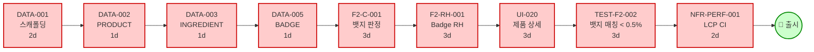

# 🗓 개발 일정 Gantt 차트 (Parallel Work Streams)

**Document ID:** TASK-GANTT-001
**Revision:** 1.0
**Date:** 2026-05-13
**기반 문서:**
- [`06_TASK_LIST_v1.md`](./06_TASK_LIST_v1.md) v1.1 (131개 MVP TASK)
- [`06_TASK_DEPENDENCY_DIAGRAM_v1.md`](./06_TASK_DEPENDENCY_DIAGRAM_v1.md) v1.1 (138개 노드)
- [`06_TASK_LIST_v1.md` §9 의존성 다이어그램](./06_TASK_LIST_v1.md#9-의존성-다이어그램) (Phase 추상)

> 본 문서는 §9의 Phase 단위 추상 다이어그램을 **시간 축(달력)** 에 매핑하여,
> "**누가, 언제, 무엇을 동시에 진행할 수 있는가**" 를 한눈에 보여주는 일정 계획서다.

---

## 0. TL;DR — 한눈에 보는 결론

| 항목 | 값 |
|---|---|
| 시작일 | **2026-05-13 (Wed)** |
| 예상 완료일 (MVP) | **2026-07-17 (Fri)** — 총 **약 47 영업일 / 9.5주** |
| 권장 동시 작업 스트림 수 | **6 ~ 8 lanes** (개발자 2~3명 + UI 1명 가정) |
| 임계 경로 (Critical Path) | `DATA-001 → DATA-002 → DATA-003 → DATA-005 → F2-C-001 → F2-RH-001 → TEST-F2-002 → 출시` |
| 최대 병렬도 발생 시점 | Week 3~5 (Phase 2 CQRS 로직) — 최대 **8개 작업 동시 진행** |
| 단일 SPOF (Single Point Of Failure) 노드 | `DATA-001`(전체 시작), `F1-RH-001`(F1·F3·UI 핵심), `COM-C-002`(인증·관리자) |

---

## 1. 병렬 워크 스트림 매트릭스 (한눈에 보기)

> 각 행 = 독립적으로 진행 가능한 **워크 스트림** (Swim Lane).
> 같은 열에 있는 셀은 **같은 시기에 동시 진행 가능**.

| Lane | Wk1 (5/13~) | Wk2 | Wk3 | Wk4 | Wk5 | Wk6 | Wk7 | Wk8~9 |
|---|---|---|---|---|---|---|---|---|
| 🏗 **L1 인프라** | DATA-001 | NFR-001/002/003/005/006 | NFR-ARCH-001 | — | — | — | NFR-MON-001~003 | NFR-COST-* |
| 📊 **L2 DB 스키마** | — | DATA-002~009 | DATA-012 → DATA-010 | DATA-011 (Seed) | — | — | — | — |
| 🔌 **L3 API 계약/Mock** | — | API-006/007/008 | API-001~005 → MOCK-001~006 | — | — | — | — | — |
| 🎨 **L4 UI 디자인 시스템** | — | UI-001 | UI-002/003/004 → UI-021/022 | — | — | — | — | — |
| ⚡ **L5 F1 Super-Calc** | — | — | F1-Q-001/002 · F1-C-001~004 | **F1-RH-001** | CRON-001 | — | — | — |
| 🛡 **L6 F2 Anti-BS** | — | — | F2-Q-001/002 · F2-C-002/003 | F2-C-001/004/005 → **F2-RH-001** | — | — | — | — |
| 👤 **L7 인증·검색·공통** | — | — | COM-C-001 · COM-Q-001/002 | COM-C-002 · COM-RH-001 · COM-C-003~005 | — | — | — | — |
| 📝 **L8 F4 데이터 신뢰** | — | — | F4-Q-001/002 · F4-C-001 | F4-C-002/003 → F4-C-004 → F4-C-005 | — | — | — | — |
| 📢 **L9 F3 카카오 공유** | — | — | F3-C-001 → F3-C-002 → F3-C-003 | F3-Q-001 | — | — | — | — |
| 🖼 **L10 UI 도메인 화면** | — | — | — | UI-010/011/013/020 | UI-012/023/024/025/030/031/040~042/050/051 | UI-060/061/062 | — | — |
| 🛠 **L11 관리자 백오피스** | — | — | — | ADM-Q-001/002 | ADM-C-001/002 | — | — | — |
| 🧪 **L12 테스트 자동화** | — | — | — | — | TEST-F1-* | TEST-F2-* · TEST-F3-* | TEST-F4-* · TEST-COM-* | — |
| 🔒 **L13 비기능 검증** | — | — | — | — | — | NFR-PERF-001 · NFR-SEC-* | NFR-PERF-002 · NFR-MON-004 | NFR-COST-002 |

**범례:** 굵게 표시된 노드는 **임계 경로 핵심 노드** (지연 시 출시일 직접 영향).

---

## 2. 임계 경로 (Critical Path) — 가장 긴 경로

> 이 경로의 어느 한 태스크라도 지연되면 **MVP 출시일 자체가 지연**된다.



**임계 경로 합산:** `2 + 1 + 1 + 1 + 3 + 3 + 3 + 3 + 2 = 19d` (Phase 0→2→3→4 직렬 누적)
**버퍼 포함 실제 소요:** ~25 영업일 (의존 노드 wait 시간 포함)

---

## 3. 📊 상세 Gantt 차트 (Mermaid)

> 가로축 = 달력 (영업일 기준, 주말 제외). 동일 섹션의 막대가 **수직으로 겹치면 → 동시 진행 가능**.
> `crit` 태그가 붙은 막대는 **임계 경로**.

```mermaid
gantt
    title 건기식 비교 플랫폼 MVP — 9.5주 개발 일정 (2026-05-13 ~ 2026-07-17)
    dateFormat YYYY-MM-DD
    axisFormat %m/%d
    excludes weekends

    section 🏗 L1 인프라
    DATA-001 프로젝트 스캐폴딩          :crit, d001, 2026-05-13, 2d
    NFR-001 Vercel 자동 배포            :n001, after d001, 2d
    NFR-002 Supabase 연결               :n002, after d001, 2d
    NFR-003 Storage 버킷                :n003, after n002, 1d
    NFR-005 환경변수 체계               :n005, after n001, 1d
    NFR-006 Vercel AI SDK + Gemini      :n006, after n005, 1d
    NFR-004 Cron Job 스케줄             :n004, after n001, 1d
    NFR-ARCH-001 Adapter Pattern        :narch, after a006, 2d

    section 📊 L2 DB 스키마
    DATA-002 PRODUCT                    :crit, d002, after d001, 1d
    DATA-009 USER                       :d009, after d001, 1d
    DATA-003 INGREDIENT                 :crit, d003, after d002, 1d
    DATA-004 PRICE_SNAPSHOT             :d004, after d002, 1d
    DATA-006 LABEL_ARCHIVE              :d006, after d002, 1d
    DATA-005 BADGE                      :crit, d005, after d003, 1d
    DATA-007 ERROR_REPORT               :d007, after d002 d009, 2d
    DATA-008 COMPARISON_HISTORY         :d008, after d009, 1d
    DATA-012 REWARD_LEDGER+USER_BADGE   :d012, after d007 d009, 2d
    DATA-010 ERD 통합 검증              :d010, after d005 d004 d006 d012, 2d
    DATA-011 Seed Data (300~500제품)    :d011, after d010, 3d

    section 🔌 L3 API/Mock
    API-006 쿠팡 Adapter IF             :a006, after d001, 2d
    API-007 식약처 API 타입             :a007, after d001, 1d
    API-008 공통 에러 스키마            :a008, after d001, 2d
    API-001 Super-Calc DTO              :a001, after d004, 2d
    API-002 Badge DTO                   :a002, after d005, 2d
    API-003 Search DTO                  :a003, after d002 d003, 1d
    API-004 오류 제보 DTO               :a004, after d007, 2d
    API-005 제품 등록 DTO               :a005, after d002, 1d
    MOCK-005 쿠팡 Fake Adapter          :m005, after a006, 2d
    MOCK-006 식약처 API Stub            :m006, after a007, 1d
    MOCK-001 Super-Calc Mock            :m001, after a001, 2d
    MOCK-002 Badge Mock                 :m002, after a002, 2d
    MOCK-003 Search Mock                :m003, after a003, 1d
    MOCK-004 오류 제보 Mock             :m004, after a004, 1d

    section 🎨 L4 UI 디자인 시스템
    UI-001 디자인 시스템 (shadcn)       :ui001, after d001, 2d
    UI-002 공통 레이아웃                :ui002, after ui001, 2d
    UI-003 토스트 컴포넌트              :ui003, after ui001, 1d
    UI-004 스켈레톤/로더                :ui004, after ui001, 1d
    UI-021 뱃지 4색 컴포넌트            :ui021, after ui001, 2d
    UI-022 일상어 괄호 컴포넌트         :ui022, after ui001, 1d
    UI-023 뱃지 출처 표시               :ui023, after ui021, 1d

    section ⚡ L5 F1 Super-Calc
    F1-Q-001 쿠팡 가격 조회             :f1q1, after a006 m005, 3d
    F1-Q-002 캐시 폴백 조회             :f1q2, after f1q1 d004, 2d
    F1-C-001 1일 단가 정규화            :f1c1, after a001 d004, 2d
    F1-C-002 실지불가 산출              :f1c2, after f1c1, 2d
    F1-C-003 오름차순 정렬              :f1c3, after f1c1, 1d
    F1-C-004 PRICE_SNAPSHOT 저장        :f1c4, after f1c1 d004, 1d
    F1-RH-001 Super-Calc RH 통합        :crit, f1rh, after f1q1 f1q2 f1c2 f1c3 f1c4, 3d
    CRON-001 가격 동기화 Cron           :cron, after f1rh n001, 3d

    section 🛡 L6 F2 Anti-BS
    F2-Q-001 성분 조회                  :f2q1, after d003, 1d
    F2-Q-002 식약처 기능성 원료 조회    :f2q2, after a007 m006, 2d
    F2-C-002 금지표현 검증              :f2c2, after d001, 2d
    F2-C-003 일상어 번역 매핑           :f2c3, after d003, 2d
    F2-C-001 뱃지 판정 로직             :crit, f2c1, after f2q1 f2q2 d005 f2c2, 3d
    F2-C-004 미등재 회색 라벨           :f2c4, after f2c1, 1d
    F2-C-005 뱃지 캐싱 (TTL 24h)        :f2c5, after f2c1, 2d
    F2-RH-001 Badge RH 통합             :crit, f2rh, after f2c1 f2c4 f2c5 f2q2, 3d

    section 👤 L7 인증·검색·공통
    COM-C-001 이메일 가입               :cc1, after d009, 2d
    COM-C-002 인증/세션 관리            :cc2, after cc1, 3d
    COM-Q-001 검색+자동완성             :cq1, after a003 d002 d003, 2d
    COM-Q-002 미등록 안내+CTA           :cq2, after cq1, 1d
    COM-RH-001 Search RH 통합           :crh, after cq1 cq2, 2d
    COM-C-003 제품 등록 요청 접수       :cc3, after a005 d002, 1d
    COM-C-004 제휴 클릭 Mixpanel        :cc4, after d001, 1d
    COM-C-005 카카오 공유 Mixpanel      :cc5, after d001, 1d

    section 📝 L8 F4 데이터 신뢰
    F4-Q-001 출처 조회                  :f4q1, after d005 d006, 2d
    F4-Q-002 라벨 이미지 조회           :f4q2, after d006 n003, 1d
    F4-C-001 오류 제보 접수             :f4c1, after a004 d007, 2d
    F4-C-002 스팸 필터링                :f4c2, after f4c1, 2d
    F4-C-003 제보 상태 변경             :f4c3, after f4c1, 2d
    F4-C-004 이메일 알림 (Resend)       :f4c4, after f4c3, 2d
    F4-C-005 보상 지급 (Ledger)         :f4c5, after f4c3 f4c4 d012 cc2, 2d

    section 📢 L9 F3 카카오 공유
    F3-C-001 OG 메타태그 구성           :f3c1, after d001, 1d
    F3-C-002 카카오 Link API 호출       :f3c2, after f3c1, 2d
    F3-C-003 카카오 장애 폴백           :f3c3, after f3c2, 2d
    F3-Q-001 공유 카드 랜딩 데이터      :f3q1, after f1rh, 2d

    section 🖼 L10 UI 도메인 화면
    UI-010 메인 검색 페이지             :ui010, after ui002 m003, 2d
    UI-011 단가 비교 결과 페이지        :ui011, after ui002 m001, 3d
    UI-012 캐시 시각 인라인 표시        :ui012, after ui011, 1d
    UI-013 미등록 성분 안내+CTA         :ui013, after ui010, 1d
    UI-020 제품 상세 페이지             :crit, ui020, after ui002 m001 m002, 3d
    UI-024 출처 아코디언                :ui024, after ui020, 2d
    UI-025 라벨 이미지 뷰어             :ui025, after ui024, 1d
    UI-030 오류 신고 폼 모달            :ui030, after ui002 m004, 2d
    UI-031 접수 확인 알림               :ui031, after ui003, 1d
    UI-040 카카오 공유 버튼             :ui040, after ui001 ui003 ui011 f3c1 f3c2 f3c3 cc5, 2d
    UI-041 URL 복사 폴백 UI             :ui041, after ui040 ui003, 2d
    UI-042 공유 카드 랜딩 페이지        :ui042, after ui011, 2d
    UI-050 회원가입/로그인 페이지       :ui050, after ui002, 2d
    UI-051 마케팅 0건 차단 검증         :ui051, after ui020, 1d

    section 🛠 L11 관리자 백오피스
    ADM-Q-001 등록 요청 목록 (Query)    :adm1q, after cc3, 1d
    ADM-C-001 등록 상태 관리 (Cmd)      :adm1c, after adm1q, 2d
    ADM-Q-002 제보 목록 (Query)         :adm2q, after f4c1, 1d
    ADM-C-002 제보 워크플로 (Cmd)       :adm2c, after adm2q f4c3, 2d
    UI-060 관리자 로그인+RBAC           :ui060, after cc2, 2d
    UI-061 등록 요청 대시보드           :ui061, after adm1q ui002, 2d
    UI-062 제보 관리 대시보드           :ui062, after adm2q ui002, 3d

    section 🧪 L12 테스트 자동화
    TEST-F1-001~003 단위 (정규화/정렬)  :tf1u, after f1c1 f1c2 f1c3, 2d
    TEST-F1-004~006 통합 (E2E/폴백)     :tf1i, after f1rh, 3d
    TEST-F2-001~005 단위 (뱃지/금지표현):tf2u, after f2rh, 3d
    TEST-F2-002 뱃지 매칭 < 0.5%        :crit, tf2crit, after f2c1, 3d
    TEST-F2-006 Badge p95 ≤ 1s          :tf2p, after f2rh, 2d
    TEST-F3-001~003 카카오/랜딩         :tf3, after f3c3 f3q1, 2d
    TEST-F4-001~006 출처/스팸/생명주기  :tf4, after f4c5, 3d
    TEST-COM-001~003 회원/검색/이벤트   :tcom, after crh cc4 cc5, 2d

    section 🔒 L13 비기능 검증
    NFR-PERF-001 LCP ≤ 2.5s Lighthouse  :crit, nperf1, after n001 ui001, 2d
    NFR-PERF-002 동시접속 50/100명       :nperf2, after f1rh f2rh, 2d
    NFR-SEC-001 TLS / SSL Labs A        :nsec1, after n001, 1d
    NFR-SEC-002 최소 수집 검증          :nsec2, after cc1, 1d
    NFR-SEC-003 금지 표현 거버넌스      :nsec3, after f2c2, 2d
    NFR-MON-001 Vercel Analytics+Logs   :nmon1, after n001, 2d
    NFR-MON-002 Slack Webhook           :nmon2, after nmon1, 2d
    NFR-MON-003 Mixpanel 대시보드       :nmon3, after n001, 2d
    NFR-MON-004 SLA 48h 초과 알림       :nmon4, after f4c3 nmon2, 1d
    NFR-COST-001 비용 8만원 경고        :ncost1, after n001 n002, 2d
    NFR-COST-002 월 1회 비용 리포트     :ncost2, after ncost1, 1d

    section 🚀 출시 마일스톤
    🎯 Phase 1 SSOT 확정                :milestone, mPh1, 2026-05-29, 0d
    🎯 Phase 2 핵심 RH 완료              :milestone, mPh2, 2026-06-12, 0d
    🎯 Phase 3 UI/관리자 완료            :milestone, mPh3, 2026-06-30, 0d
    🎯 Phase 4 테스트/NFR 완료           :milestone, mPh4, 2026-07-15, 0d
    🚀 MVP 출시 (Closed Beta)            :milestone, mLaunch, 2026-07-17, 0d
```



---

## 4. 🔗 핵심 동시 진행 묶음 (Parallel Bundles)

> 각 묶음은 **선행 조건만 충족되면 동시에 시작 가능**한 태스크 그룹이다.

### 4.1 Bundle A — `DATA-001` 완료 직후 즉시 8개 동시 시작 가능 ⭐

```
DATA-001 ──┬─→ DATA-002 (PRODUCT)
           ├─→ DATA-009 (USER)
           ├─→ API-006 (쿠팡 Adapter IF)
           ├─→ API-007 (식약처 타입)
           ├─→ API-008 (공통 에러)
           ├─→ NFR-001 (Vercel 배포)
           ├─→ NFR-002 (Supabase 연결)
           ├─→ UI-001 (디자인 시스템)
           ├─→ F2-C-002 (금지 표현 검증)
           ├─→ F3-C-001 (OG 메타태그)
           ├─→ COM-C-004 (제휴 클릭 추적)
           └─→ COM-C-005 (카카오 공유 추적)
```

⚠️ **중요:** 이 시점이 **최대 병렬도** 구간. 인력 부족 시 우선순위:
1. DATA-002 / DATA-009 / API-006 (다음 단계 차단)
2. NFR-001 / NFR-002 (배포 환경)
3. UI-001 (디자인 시스템)

### 4.2 Bundle B — Phase 2 진입 후 (Week 3) 동시 진행 가능

```
PHASE 2 시작 (Week 3 ~ Week 5)
├─ L5 Super-Calc 트랙 (F1)
│   └─ F1-Q-001 ‖ F1-C-001 (병렬, MOCK-005·API-001 완료 후)
├─ L6 Anti-BS 트랙 (F2)
│   └─ F2-Q-001 ‖ F2-Q-002 ‖ F2-C-002 ‖ F2-C-003 (4-way 병렬)
├─ L7 인증·검색 트랙
│   └─ COM-C-001 ‖ COM-Q-001 (병렬)
├─ L8 데이터 신뢰 트랙 (F4)
│   └─ F4-Q-001 ‖ F4-Q-002 ‖ F4-C-001 (3-way 병렬)
├─ L9 카카오 공유 트랙 (F3)
│   └─ F3-C-001 → F3-C-002 → F3-C-003 (직렬, 단 다른 트랙과 병렬)
└─ L10 UI 도메인 트랙 (MOCK 의존)
    └─ UI-010 ‖ UI-011 ‖ UI-020 (3-way 병렬, 디자인 시스템 완료 후)
```

### 4.3 Bundle C — Phase 4 테스트 (Week 6 ~ 8) 동시 진행 가능

테스트는 자신의 SUT(System Under Test) 완료 후 즉시 시작 — **트랙 간 완전 독립 병렬**.

| 트랙 | 진입 조건 | 동시 진행 가능 테스트 |
|---|---|---|
| TEST-F1-* | `F1-RH-001` 완료 | 6건 |
| TEST-F2-* | `F2-RH-001` 완료 | 6건 |
| TEST-F3-* | `F3-C-003` / `F3-Q-001` 완료 | 3건 |
| TEST-F4-* | `F4-C-005` 완료 | 6건 |
| TEST-COM-* | `COM-RH-001`, `COM-C-004/005` 완료 | 3건 |

---

## 5. 👥 권장 인력 배치 (Resource Allocation)

> MVP 9.5주 기간 동안 **2~3명 풀스택 + 1명 UI/디자인** 가정.

| Role | 담당 Lane | 핵심 책임 | 주력 Phase |
|---|---|---|---|
| **Dev A — 백엔드 리드** | L2, L3, L5, L8 | DB 스키마 / Adapter / Super-Calc / 데이터 신뢰 | Wk 1 ~ 5 |
| **Dev B — 풀스택** | L6, L7, L9, L11 | Anti-BS / 인증 / 카카오 / 관리자 | Wk 2 ~ 6 |
| **Dev C — 인프라/DevOps (or Dev A 겸직)** | L1, L13 | Vercel / Supabase / Cron / 모니터링 / NFR | Wk 1 ~ 9 |
| **Designer/UI Dev** | L4, L10 | shadcn 디자인 시스템 / 도메인 화면 | Wk 2 ~ 7 |
| **QA (or Dev 겸직)** | L12 | 테스트 자동화 (Vitest + Playwright) | Wk 5 ~ 9 |

**🚨 1인 개발 시 우선순위:** L1 → L2 → L3 → L5(F1) → L4·L10(UI 최소 셋) → L6(F2) → L9(F3) → L7·L11 → L12·L13

---

## 6. ⚠️ 병목 노드 (Bottleneck Nodes)

> 의존성 다이어그램에서 **fan-out** 또는 **fan-in** 이 큰 노드. 우선 사수.

| Node | Fan-out / Fan-in | 영향 범위 | 권장 대응 |
|---|---|---|---|
| **DATA-001** | fan-out **12** | 전체 시작 | Day 1~2 최우선 완료, 1인 전담 |
| **DATA-002** | fan-out **6** | 모든 DATA·API 트랙 | 1일 내 완료, 충분한 리뷰 |
| **F1-RH-001** | fan-out **5** | F3, CRON, UI-011, TEST-F1, NFR-PERF-002 | Phase 2 중간 마일스톤 |
| **F2-RH-001** | fan-out **3** | UI-020, TEST-F2, NFR-PERF-002 | Phase 2 종료 마일스톤 |
| **COM-C-002** | fan-out **3** | F4-C-005, UI-060, UI-050 | Phase 2 후반 |
| **DATA-010** | fan-in **8** | 모든 DB 스키마 통합 | Phase 1 게이트 |
| **F2-C-001** | fan-in **4** | 뱃지 판정 (Anti-BS 핵심) | 임계 경로 |
| **F4-C-005** | fan-in **4** | 보상 Ledger (트랜잭션 원자성) | Phase 2 종료 직전 |

---

## 7. 📈 Phase별 마일스톤 요약

| Phase | 기간 | 영업일 | 종료 게이트 (Exit Criteria) |
|---|---|---|---|
| **Phase 0 — 인프라** | 5/13 ~ 5/14 | 2d | `DATA-001` ✅ 다음 모든 트랙 시작 가능 |
| **Phase 1 — SSOT** | 5/15 ~ 5/29 | 11d | `DATA-010` ✅ + `DATA-011` ✅ + `MOCK-001~006` ✅ |
| **Phase 2 — CQRS 로직** | 5/29 ~ 6/12 | 10d | `F1-RH-001` ✅ + `F2-RH-001` ✅ + `COM-RH-001` ✅ + `F4-C-005` ✅ |
| **Phase 3 — UI/관리자** | 6/12 ~ 6/30 | 13d | 모든 `UI-*` ✅ + `ADM-*` ✅ + `F3-*` ✅ |
| **Phase 4 — 테스트/NFR** | 6/30 ~ 7/15 | 11d | 모든 `TEST-*` 통과 + `NFR-PERF-001` LCP ≤ 2.5s + SSL Labs A |
| **🚀 Launch** | 7/17 | — | Closed Beta 오픈 (3 명 모니터링 + 24h hot-fix 대기) |

---

## 8. 🔁 Should/Could (Phase 2 이후) — 본 일정 외 별도 추적

| Task | 의존 | 예상 도입 |
|---|---|---|
| P2-001 비교 이력 저장/재조회 | DATA-008, COM-C-002 | MVP 출시 + 4주 |
| P2-002 트렌드 성분 팩트체크 | F2-RH-001 | MVP 출시 + 6주 |
| P2-003 가격 하락 이메일 알림 | CRON-001, F4-C-004 | MVP 출시 + 8주 |
| P2-004 3탭 비교 UX | UI-010, UI-011 | MVP 출시 + 8주 |
| P2-005 B2B 마켓 인텔리전스 | DATA-010, COM-C-002 | MVP 출시 + 12주 |
| P2-006 자동 DB 백업 | NFR-002 | MVP 출시 + 4주 |
| P2-007 가용성 SLA 체계 | NFR-MON-001 | MVP 출시 + 6주 |

---

## 9. 📚 참조

- [`06_TASK_LIST_v1.md`](./06_TASK_LIST_v1.md) — 131개 MVP TASK 명세
- [`06_TASK_DEPENDENCY_DIAGRAM_v1.md`](./06_TASK_DEPENDENCY_DIAGRAM_v1.md) — 138개 노드 상세 의존성
- [`docs/05_SRS_v1.md`](../docs/05_SRS_v1.md) — SRS-001 v1.4 (요구사항 SSOT)
- [`docs/00_PRD_v1_0.md`](../docs/00_PRD_v1_0.md) — PRD v1.0 (비즈니스 SSOT)
- [`AGENTS.md`](../AGENTS.md) — Cross-tool 글로벌 규칙

---

*— End of TASK-GANTT-001 v1.0 —*
