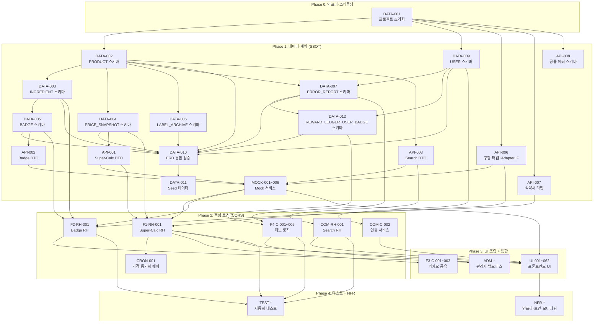

# 📋 개발 태스크 목록 명세서 (Task Breakdown Specification)

**Document ID:** TASK-001  
**Revision:** 1.1  
**Date:** 2026-04-20  
**기반 문서:** SRS-001 v1.4 (2026-04-17)  
**작성 관점:** Technical Project Manager / System Architect  

> **v1.1 Changelog (2026-04-20)** — DATA-012(REWARD_LEDGER + USER_BADGE) 신설, F4-C-005 의존성에 DATA-012/F4-C-004/COM-C-002 추가, DATA-010 의존성에 DATA-012 포함, Mermaid 의존성 그래프 갱신, Step 1 태스크 수 25→26, MVP 총계 130→131.

---

## 목차

1. [태스크 추출 원칙](#1-태스크-추출-원칙)
2. [Epic/도메인 분류 체계](#2-epic도메인-분류-체계)
3. [Step 1 — 계약·데이터 명세 태스크](#3-step-1--계약데이터-명세-태스크)
4. [Step 2 — 로직·상태 변경 태스크 (CQRS)](#4-step-2--로직상태-변경-태스크-cqrs)
5. [Step 3 — 테스트 태스크 (AC → 자동화)](#5-step-3--테스트-태스크-ac--자동화)
6. [Step 4 — 비기능·인프라·보안 태스크](#6-step-4--비기능인프라보안-태스크)
7. [Step 5 — UI/UX 프론트엔드 태스크](#7-step-5--uiux-프론트엔드-태스크)
8. [전체 태스크 요약 테이블](#8-전체-태스크-요약-테이블)
9. [의존성 다이어그램](#9-의존성-다이어그램)
10. [부록 — Should/Could 태스크 (Phase 2)](#10-부록--shouldcould-태스크-phase-2)

---

## 1. 태스크 추출 원칙

| # | 원칙 | 설명 |
|---|---|---|
| P1 | **데이터·계약 우선 (SSOT)** | DB 스키마, API DTO, Mock 데이터를 최우선 도출. 에이전트가 참조할 단일 진실 공급원 확보 |
| P2 | **CQRS 분리** | 상태 변경(Write/Command)과 조회(Read/Query)를 별개 태스크로 격리 |
| P3 | **AC → 테스트 코드** | 인수 조건(AC)을 체크리스트가 아닌 자동화된 테스트 태스크로 변환 |
| P4 | **닫힌 문맥 (Closed Context)** | 태스크 1건 = 단일 목적. 기존 코드 훼손 최소화 |
| P5 | **UI/백엔드 분리** | 프론트엔드 UI 조립과 백엔드 로직 구현을 별도 태스크로 추출 |

---

## 2. Epic/도메인 분류 체계

| Epic ID | Epic 이름 | 대응 SRS 범위 | 설명 |
|---|---|---|---|
| **E-INFRA** | 프로젝트 인프라·초기 설정 | §1.2.3 CON-7~13, §3.6 | Next.js 프로젝트 초기화, CI/CD, 인프라 구성 |
| **E-DATA** | 데이터 모델·스키마 | §6.2 Entity & Data Model | DB 스키마, 마이그레이션, Seed 데이터 |
| **E-API** | API 계약·DTO 정의 | §3.3, §6.1 | 내부/외부 API Request/Response DTO, 에러 코드 정의 |
| **E-MOCK** | Mock 데이터·Stub 서비스 | §6.1, §6.2 | 프론트엔드 개발용 Mocking API/데이터 |
| **E-F1** | Super-Calc Engine | §4.1.1, §3.4.1, §6.3.1 | 1일 단가 정규화 엔진 (비교·정렬) |
| **E-F2** | Anti-BS Dashboard | §4.1.2, §3.4.2, §6.3.2 | 식약처 뱃지 판정·일상어 번역 |
| **E-F3** | Viral Engine | §4.1.3, §3.4.3, §6.3.4 | 카카오톡 1-Tap 공유 |
| **E-F4** | Data Trust System | §4.1.4, §6.3.3 | 라벨 아카이브, 오류 제보·보상 |
| **E-COMMON** | 공통 기능 | §4.1.5 | 인증, 검색, 제품 상세, 이벤트 추적 |
| **E-ADMIN** | 관리자 백오피스 | §4.1.5 REQ-FUNC-032 | 등록 요청·제보 관리 대시보드 |
| **E-NFR** | 비기능·보안·모니터링 | §4.2 | 성능, 보안, 로깅, 비용 관리 |
| **E-UI** | 프론트엔드 UI 조립 | §3.2, §3.5, §3.6 | 모바일 웹 앱 화면 단위 컴포넌트 조립 |
| **E-TEST** | 테스트 자동화 | §5 Traceability Matrix | AC 기반 단위/통합/E2E 테스트 |

---

## 3. Step 1 — 계약·데이터 명세 태스크

> **목적:** 백엔드와 프론트엔드의 기준점이 될 SSOT(Single Source of Truth)를 확보한다.

### 3.1 데이터베이스 스키마 태스크

| Task ID | Epic | Feature (기능명) | 관련 SRS 섹션 | 선행 태스크 (Dependencies) | 복잡도 |
|---|---|---|---|---|---|
| **DATA-001** | E-INFRA | Next.js App Router + Prisma + Tailwind + shadcn/ui 프로젝트 초기 스캐폴딩 | §1.2.3 CON-7~10 | None | M |
| **DATA-002** | E-DATA | PRODUCT 테이블 Prisma 스키마 정의 및 마이그레이션 생성 | §6.2.1 PRODUCT | DATA-001 | L |
| **DATA-003** | E-DATA | INGREDIENT 테이블 Prisma 스키마 정의 및 마이그레이션 생성 (FK → PRODUCT) | §6.2.2 INGREDIENT | DATA-002 | L |
| **DATA-004** | E-DATA | PRICE_SNAPSHOT 테이블 Prisma 스키마 정의 및 마이그레이션 생성 (FK → PRODUCT) | §6.2.3 PRICE_SNAPSHOT | DATA-002 | L |
| **DATA-005** | E-DATA | BADGE 테이블 Prisma 스키마 정의 및 마이그레이션 생성 (FK → INGREDIENT, Enum: APPROVED/CAUTION/NOT_APPROVED) | §6.2.4 BADGE | DATA-003 | L |
| **DATA-006** | E-DATA | LABEL_ARCHIVE 테이블 Prisma 스키마 정의 및 마이그레이션 생성 (FK → PRODUCT) | §6.2.5 LABEL_ARCHIVE | DATA-002 | L |
| **DATA-007** | E-DATA | ERROR_REPORT 테이블 Prisma 스키마 정의 및 마이그레이션 생성 (FK → PRODUCT, USER, Enum: SUBMITTED/REVIEWING/RESOLVED/REJECTED) | §6.2.6 ERROR_REPORT | DATA-002, DATA-009 | M |
| **DATA-008** | E-DATA | COMPARISON_HISTORY 테이블 Prisma 스키마 정의 (비교 이력 저장용, FK → USER) | §4.1.5 REQ-FUNC-035 | DATA-009 | L |
| **DATA-009** | E-DATA | USER 테이블 Prisma 스키마 정의 및 마이그레이션 생성 (최소 수집: email, persona_type) | §6.2.7 USER, CON-4 | DATA-001 | L |
| **DATA-012** | E-DATA | REWARD_LEDGER + USER_BADGE 테이블 Prisma 스키마 정의 및 마이그레이션 (보상 Ledger 패턴, CON-4 준수, F4-C-005 선행) | §4.1.4 REQ-FUNC-026, §3.6 Reward Module, CON-4 | DATA-007, DATA-009 | M |
| **DATA-010** | E-DATA | Prisma ERD 전체 관계 검증 및 통합 마이그레이션 실행 (`prisma migrate dev`) | §6.2.8 ER Summary | DATA-002~009, DATA-012 | M |
| **DATA-011** | E-DATA | MVP 초기 Seed 데이터 스크립트 작성 (상위 300~500개 제품, 성분, 식약처 공전 데이터 로컬 적재) | §3.1.1 사전 데이터 확보 원칙 | DATA-010 | H |

### 3.2 API 계약·DTO 정의 태스크

| Task ID | Epic | Feature (기능명) | 관련 SRS 섹션 | 선행 태스크 (Dependencies) | 복잡도 |
|---|---|---|---|---|---|
| **API-001** | E-API | Super-Calc API (`GET /api/v1/compare`) Request/Response DTO 및 에러 코드 TypeScript 타입 정의 | §6.1.2 INT-API-01, §3.3 | DATA-004 | M |
| **API-002** | E-API | Badge API (`GET /api/v1/badges`) Request/Response DTO 및 에러 코드 TypeScript 타입 정의 | §6.1.2 INT-API-02, §3.3 | DATA-005 | M |
| **API-003** | E-API | Search API (`GET /api/v1/search`) Request/Response DTO 및 에러 코드 TypeScript 타입 정의 | §6.1.2 INT-API-03 | DATA-002, DATA-003 | L |
| **API-004** | E-API | 오류 제보 Server Action (`POST`) FormData 스키마 및 응답 DTO TypeScript 타입 정의 | §6.1.2 INT-API-04 | DATA-007 | M |
| **API-005** | E-API | 제품 등록 요청 Server Action (`POST`) FormData 스키마 및 응답 DTO TypeScript 타입 정의 | §6.1.2 INT-API-05 | DATA-002 | L |
| **API-006** | E-API | 쿠팡 파트너스 외부 API 응답 타입 정의 및 ChannelAdapter 인터페이스 설계 (Strategy Pattern) | §6.1.1 EXT-API-01, §4.2.6 REQ-NF-024 | DATA-001 | M |
| **API-007** | E-API | 식약처 건강기능식품 공공 데이터 API 응답 타입 정의 | §6.1.1 EXT-API-02 | DATA-001 | L |
| **API-008** | E-API | 공통 에러 응답 스키마 정의 (HTTP Status Code 체계, 에러 코드 Enum, 에러 메시지 포맷) | §6.1 전체 | DATA-001 | M |

### 3.3 Mock 데이터·Stub 서비스 태스크

| Task ID | Epic | Feature (기능명) | 관련 SRS 섹션 | 선행 태스크 (Dependencies) | 복잡도 |
|---|---|---|---|---|---|
| **MOCK-001** | E-MOCK | Super-Calc API Mock 엔드포인트 구성 (성공/쿠팡 장애 폴백/빈 결과 시나리오) | §3.4.1, §3.1.1 폴백 | API-001 | M |
| **MOCK-002** | E-MOCK | Badge API Mock 엔드포인트 구성 (캐시 Hit/Miss, 미등재 원료 시나리오) | §3.4.2 | API-002 | M |
| **MOCK-003** | E-MOCK | Search API Mock 엔드포인트 구성 (자동완성 후보, 미등록 성분 시나리오) | §4.1.1 REQ-FUNC-008 | API-003 | L |
| **MOCK-004** | E-MOCK | 오류 제보 Mock Server Action 구성 (성공/스팸 차단/빈 문자열 차단 시나리오) | §6.3.3 | API-004 | L |
| **MOCK-005** | E-MOCK | 쿠팡 파트너스 외부 API Stub 서비스 (개발/테스트 환경용 Fake Adapter) | §6.1.1 EXT-API-01 | API-006 | M |
| **MOCK-006** | E-MOCK | 식약처 공공 데이터 API Stub 서비스 (개발/테스트 환경용) | §6.1.1 EXT-API-02 | API-007 | L |

---

## 4. Step 2 — 로직·상태 변경 태스크 (CQRS)

> **목적:** 데이터 조회(Query)와 상태 변경(Command)을 엄격히 분리하여 에이전트가 단일 목적에 집중하도록 격리한다.

### 4.1 E-F1: Super-Calc Engine

| Task ID | Epic | Feature (기능명) | 관련 SRS 섹션 | 선행 태스크 (Dependencies) | 복잡도 |
|---|---|---|---|---|---|
| **F1-Q-001** | E-F1 | [Query] 쿠팡 파트너스 API 단일 채널 가격 조회 로직 구현 (CoupangAdapter) | §4.1.1 REQ-FUNC-001, §6.3.1 | API-006, MOCK-005 | H |
| **F1-Q-002** | E-F1 | [Query] 쿠팡 API 장애 시 캐시 PRICE_SNAPSHOT 조회 폴백 로직 구현 | §3.1.1 EXT-SYS-01 폴백, §6.3.1 alt | F1-Q-001, DATA-004 | M |
| **F1-C-001** | E-F1 | [Command] 1일 단가 정규화 산출 엔진 구현 (`제품 가격 ÷ 총 복용 횟수`, 소수점 첫째 자리) | §4.1.1 REQ-FUNC-002 | API-001, DATA-004 | M |
| **F1-C-002** | E-F1 | [Command] 배송비·관세·할인코드 포함 실지불가(최종가) 산출 로직 구현 (오차율 ≤ 3%) | §4.1.1 REQ-FUNC-004 | F1-C-001 | M |
| **F1-C-003** | E-F1 | [Command] 1일 단가 기준 오름차순 정렬 로직 구현 | §4.1.1 REQ-FUNC-005 | F1-C-001 | L |
| **F1-C-004** | E-F1 | [Command] PRICE_SNAPSHOT 저장 (가격 수집 결과 DB 적재 Write) | §6.3.1, §6.2.3 | F1-C-001, DATA-004 | L |
| **F1-RH-001** | E-F1 | [Route Handler] `GET /api/v1/compare` 엔드포인트 통합 조립 (조회→정규화→정렬→저장→응답) | §6.1.2 INT-API-01 | F1-Q-001, F1-Q-002, F1-C-001~003, F1-C-004 | H |

### 4.2 E-F2: Anti-BS Dashboard

| Task ID | Epic | Feature (기능명) | 관련 SRS 섹션 | 선행 태스크 (Dependencies) | 복잡도 |
|---|---|---|---|---|---|
| **F2-Q-001** | E-F2 | [Query] 제품 성분 목록 조회 로직 구현 (product_id → INGREDIENT[]) | §6.3.2, §6.2.2 | DATA-003 | L |
| **F2-Q-002** | E-F2 | [Query] 식약처 공공 API 기능성 인정 원료 조회 로직 구현 | §4.1.2 REQ-FUNC-011, §6.3.2 | API-007, MOCK-006 | M |
| **F2-C-001** | E-F2 | [Command] 뱃지 판정 로직 구현 (APPROVED/CAUTION/NOT_APPROVED 분기, 공전 원문 1:1 매칭) | §4.1.2 REQ-FUNC-011, §6.3.2 | F2-Q-001, F2-Q-002, DATA-005, F2-C-002 | H |
| **F2-C-002** | E-F2 | [Command] 금지 표현 검증 로직 구현 (질병 예방·치료 표현 원천 차단, 검출 0건 보장) | §4.1.2 REQ-FUNC-012, CON-2 | DATA-001 | M |
| **F2-C-003** | E-F2 | [Command] 전문 용어 → 일상어 번역 매핑 로직 구현 (매핑 테이블 기반, 정확도 ≥ 98%) | §4.1.2 REQ-FUNC-013 | DATA-003 | M |
| **F2-C-004** | E-F2 | [Command] 미등재 원료 회색 라벨 생성 로직 (뱃지 미부여 + 사유 툴팁) | §4.1.2 REQ-FUNC-014 | F2-C-001 | L |
| **F2-C-005** | E-F2 | [Command] 뱃지 캐싱 로직 구현 (Next.js Cache, TTL 24시간) | §3.4.2, §3.6 | F2-C-001 | M |
| **F2-RH-001** | E-F2 | [Route Handler] `GET /api/v1/badges` 엔드포인트 통합 조립 (캐시 확인→성분 조회→판정→번역→캐싱→응답) | §6.1.2 INT-API-02 | F2-Q-001~002, F2-C-001~005 | H |

### 4.3 E-F3: Viral Engine

| Task ID | Epic | Feature (기능명) | 관련 SRS 섹션 | 선행 태스크 (Dependencies) | 복잡도 |
|---|---|---|---|---|---|
| **F3-C-001** | E-F3 | [Command] 정적 OG 메타태그 URL 구성 로직 구현 (고정 서비스 로고 + title/description) | §4.1.3 REQ-FUNC-017 | DATA-001 | L |
| **F3-C-002** | E-F3 | [Command] 카카오 Link API 호출 로직 구현 (`Kakao.Link.sendDefault`) | §4.1.3 REQ-FUNC-018, §6.1.1 EXT-API-03 | F3-C-001 | M |
| **F3-C-003** | E-F3 | [Command] 카카오 API 장애 시 폴백 처리 로직 (URL 복사 + 토스트 알림, 1초 이내 전환) | §4.1.3 REQ-FUNC-021, §3.1.1 EXT-SYS-03 폴백 | F3-C-002 | M |
| **F3-Q-001** | E-F3 | [Query] 공유 카드 랜딩 페이지 데이터 조회 로직 (앱 설치/가입 불요, 비교 결과 재현) | §4.1.3 REQ-FUNC-019 | F1-RH-001 | M |

### 4.4 E-F4: Data Trust System

| Task ID | Epic | Feature (기능명) | 관련 SRS 섹션 | 선행 태스크 (Dependencies) | 복잡도 |
|---|---|---|---|---|---|
| **F4-Q-001** | E-F4 | [Query] 데이터 출처 조회 로직 (식약처 DB 링크, 라벨 이미지 URL, 논문 DOI) | §4.1.4 REQ-FUNC-022, REQ-FUNC-015 | DATA-005, DATA-006 | M |
| **F4-Q-002** | E-F4 | [Query] 라벨 아카이브 이미지 조회 로직 (Supabase Storage → 이미지 URL 반환) | §4.1.4 REQ-FUNC-023 | DATA-006, NFR-003 | L |
| **F4-C-001** | E-F4 | [Command] 오류 제보 접수 Server Action 구현 (구조화된 폼 데이터 → ERROR_REPORT 저장, status=SUBMITTED) | §4.1.4 REQ-FUNC-024, REQ-FUNC-028, §6.3.3 | API-004, DATA-007 | M |
| **F4-C-002** | E-F4 | [Command] 스팸/중복 제보 필터링 로직 구현 (동일 제품 24h 내 5건+, 빈 문자열 차단, 정확도 ≥ 95%, false positive ≤ 2%) | §4.1.4 REQ-FUNC-027 | F4-C-001 | M |
| **F4-C-003** | E-F4 | [Command] 오류 제보 처리 상태 변경 로직 (SUBMITTED → REVIEWING → RESOLVED/REJECTED) | §4.1.4 REQ-FUNC-025, §6.3.3 | F4-C-001 | M |
| **F4-C-004** | E-F4 | [Command] 제보 수정 완료 시 이메일 알림 발송 로직 (Resend API, 수정 후 1시간 이내) | §4.1.4 REQ-FUNC-026 | F4-C-003 | M |
| **F4-C-005** | E-F4 | [Command] 제보 보상(포인트/배지) 지급 로직 구현 (DATA-012 Ledger 기록 + 누적 배지 + 트랜잭션 원자성) | §4.1.4 REQ-FUNC-026, §3.6 Reward Module | F4-C-003, F4-C-004, DATA-012, COM-C-002 | M |

### 4.5 E-COMMON: 공통 기능

| Task ID | Epic | Feature (기능명) | 관련 SRS 섹션 | 선행 태스크 (Dependencies) | 복잡도 |
|---|---|---|---|---|---|
| **COM-C-001** | E-COMMON | [Command] 이메일 기반 사용자 가입 로직 구현 (최소 수집: email만, 추가 개인정보 필드 존재 금지) | §4.1.5 REQ-FUNC-029, CON-4 | DATA-009 | M |
| **COM-C-002** | E-COMMON | [Command] 사용자 인증/세션 관리 로직 구현 (Supabase Auth 또는 NextAuth 연동) | §6.3.1 Auth 서비스 | COM-C-001 | H |
| **COM-Q-001** | E-COMMON | [Query] 영양소/성분 검색 + 자동완성 로직 구현 (Search Route Handler) | §4.1.5 REQ-FUNC-030, §6.1.2 INT-API-03 | API-003, DATA-002, DATA-003 | M |
| **COM-Q-002** | E-COMMON | [Query] 미등록 성분 검색 시 안내 메시지 및 등록 요청 CTA 반환 로직 | §4.1.1 REQ-FUNC-008 | COM-Q-001 | L |
| **COM-C-003** | E-COMMON | [Command] 미등록 제품 등록 요청 접수 Server Action 구현 | §4.1.5 REQ-FUNC-032, API-005 | API-005, DATA-002 | L |
| **COM-C-004** | E-COMMON | [Command] 제휴 링크 클릭 이벤트 Mixpanel 추적 (`affiliate_link_click`) 구현 | §4.1.5 REQ-FUNC-033 | DATA-001 | L |
| **COM-C-005** | E-COMMON | [Command] 카카오 공유 이벤트 Mixpanel 추적 (`kakao_share_send`) 구현 | §4.1.5 REQ-FUNC-034 | DATA-001 | L |
| **COM-RH-001** | E-COMMON | [Route Handler] `GET /api/v1/search` 엔드포인트 통합 조립 (검색→자동완성→미등록 안내) | §6.1.2 INT-API-03 | COM-Q-001, COM-Q-002 | M |

### 4.6 E-F1 배치: Price Sync Cron

| Task ID | Epic | Feature (기능명) | 관련 SRS 섹션 | 선행 태스크 (Dependencies) | 복잡도 |
|---|---|---|---|---|---|
| **CRON-001** | E-F1 | [Command] Vercel Cron 일 1회 가격 동기화 배치 구현 (쿠팡 파트너스 → PRICE_SNAPSHOT 갱신) | §3.6 Price Sync Cron, §3.1.1 | F1-Q-001, F1-C-004, NFR-001 | H |

### 4.7 E-ADMIN: 관리자 백오피스

| Task ID | Epic | Feature (기능명) | 관련 SRS 섹션 | 선행 태스크 (Dependencies) | 복잡도 |
|---|---|---|---|---|---|
| **ADM-Q-001** | E-ADMIN | [Query] 미등록 제품 등록 요청 목록 조회 (관리자 전용) | §4.1.5 REQ-FUNC-032 | COM-C-003 | L |
| **ADM-C-001** | E-ADMIN | [Command] 등록 요청 건별 처리 상태 관리 (승인/반려/보류) | §4.1.5 REQ-FUNC-032 | ADM-Q-001 | M |
| **ADM-Q-002** | E-ADMIN | [Query] 오류 제보 목록 조회 및 필터링 (관리자 전용) | §6.3.3, REQ-FUNC-025 | F4-C-001 | L |
| **ADM-C-002** | E-ADMIN | [Command] 오류 제보 검증·수정·반려 처리 (관리자 워크플로) | §6.3.3, REQ-FUNC-025 | ADM-Q-002, F4-C-003 | M |

---

## 5. Step 3 — 테스트 태스크 (AC → 자동화)

> **목적:** SRS의 Acceptance Criteria를 에이전트가 실행 가능한 테스트 코드로 변환한다 (GWT 시나리오).

### 5.1 F1 Super-Calc 테스트

| Task ID | Epic | Feature (기능명) | 관련 SRS 섹션 | 선행 태스크 (Dependencies) | 복잡도 |
|---|---|---|---|---|---|
| **TEST-F1-001** | E-TEST | [Unit Test] 1일 단가 정규화 산출 정확도 테스트 (공식: `가격 ÷ 복용횟수`, 소수점 첫째 자리 반올림 검증) | REQ-FUNC-002 AC | F1-C-001 | M |
| **TEST-F1-002** | E-TEST | [Unit Test] 실지불가(최종가) 산출 오차율 ≤ 3% 검증 테스트 (배송비·관세·할인 포함) | REQ-FUNC-004 AC | F1-C-002 | M |
| **TEST-F1-003** | E-TEST | [Unit Test] 오름차순 정렬 정확성 테스트 (1일 단가 기준 최저가 상위) | REQ-FUNC-005 AC | F1-C-003 | L |
| **TEST-F1-004** | E-TEST | [Integration Test] 쿠팡 API 장애 시 캐시 PRICE_SNAPSHOT 폴백 반환 + 기준 시각 인라인 표시 검증 | REQ-FUNC-001 AC, §3.1.1 | F1-Q-002, F1-RH-001 | H |
| **TEST-F1-005** | E-TEST | [Unit Test] 미등록 성분 검색 시 안내 메시지 + CTA 버튼 반환 검증 (300ms 이내, 제출 성공률 99%+) | REQ-FUNC-008 AC | COM-Q-002 | M |
| **TEST-F1-006** | E-TEST | [Integration Test] Super-Calc API 엔드포인트 E2E 흐름 테스트 (검색→조회→정규화→정렬→응답, p95 ≤ 3,500ms) | REQ-FUNC-006 AC | F1-RH-001 | H |

### 5.2 F2 Anti-BS Dashboard 테스트

| Task ID | Epic | Feature (기능명) | 관련 SRS 섹션 | 선행 태스크 (Dependencies) | 복잡도 |
|---|---|---|---|---|---|
| **TEST-F2-001** | E-TEST | [Unit Test] 마케팅 콘텐츠 0건 보장 테스트 (광고 배너, 리뷰, 별점, 체험단 링크 = 0) | REQ-FUNC-010 AC | F2-RH-001 | L |
| **TEST-F2-002** | E-TEST | [Unit Test] 뱃지-공전 원문 1:1 매칭 정확도 테스트 (불일치율 < 0.5%) | REQ-FUNC-011 AC | F2-C-001 | H |
| **TEST-F2-003** | E-TEST | [Unit Test] 금지 표현(질병 예방·치료) 검출 0건 테스트 (QA 금지 표현 목록 기반) | REQ-FUNC-012 AC | F2-C-002 | M |
| **TEST-F2-004** | E-TEST | [Unit Test] 전문 용어 일상어 번역 커버리지 ≥ 95% 및 정확도 ≥ 98% 테스트 | REQ-FUNC-013 AC | F2-C-003 | M |
| **TEST-F2-005** | E-TEST | [Unit Test] 미등재 원료 회색 라벨 식별 정확도 ≥ 99%, 뱃지 오발급률 0% 테스트 | REQ-FUNC-014 AC | F2-C-004 | M |
| **TEST-F2-006** | E-TEST | [Integration Test] Badge API 엔드포인트 응답 시간 p95 ≤ 1,000ms 검증 | REQ-FUNC-011 AC, REQ-NF-002 | F2-RH-001 | M |

### 5.3 F3 Viral Engine 테스트

| Task ID | Epic | Feature (기능명) | 관련 SRS 섹션 | 선행 태스크 (Dependencies) | 복잡도 |
|---|---|---|---|---|---|
| **TEST-F3-001** | E-TEST | [Unit Test] 정적 OG 메타태그 구성 유효성 테스트 (title, description, image 필수 포함) | REQ-FUNC-017 AC | F3-C-001 | L |
| **TEST-F3-002** | E-TEST | [Integration Test] 카카오 API 장애 시 폴백 UI 전환 1초 이내 + 토스트 표시 검증 | REQ-FUNC-021 AC | F3-C-003 | M |
| **TEST-F3-003** | E-TEST | [Integration Test] 공유 카드 랜딩 페이지 로드 테스트 (앱 설치 불요, 가입 불요, p95 ≤ 2초) | REQ-FUNC-019 AC | F3-Q-001 | M |

### 5.4 F4 Data Trust System 테스트

| Task ID | Epic | Feature (기능명) | 관련 SRS 섹션 | 선행 태스크 (Dependencies) | 복잡도 |
|---|---|---|---|---|---|
| **TEST-F4-001** | E-TEST | [Unit Test] 출처 아코디언 렌더링 시간 p95 ≤ 500ms 검증 | REQ-FUNC-022 AC, REQ-NF-004 | F4-Q-001 | L |
| **TEST-F4-002** | E-TEST | [Unit Test] 라벨 이미지 로드 시간 ≤ 1초 검증 | REQ-FUNC-023 AC | F4-Q-002 | L |
| **TEST-F4-003** | E-TEST | [Unit Test] 오류 제보 접수 확인 알림 3초 이내 표시 + 예상 처리 시간(48h) 안내 검증 | REQ-FUNC-024 AC | F4-C-001 | L |
| **TEST-F4-004** | E-TEST | [Unit Test] 스팸/중복 제보 차단 테스트 (동일 제품 24h 5건+ 차단, 빈 문자열 400 에러, 유효 제보 미영향) | REQ-FUNC-027 AC | F4-C-002 | M |
| **TEST-F4-005** | E-TEST | [Integration Test] 오류 제보 전체 생명주기 테스트 (접수→검증→수정→이메일 알림→보상 지급, SLA 48h) | REQ-FUNC-025~026 AC | F4-C-003, F4-C-004, F4-C-005 | H |
| **TEST-F4-006** | E-TEST | [Unit Test] 구조화된 제보 폼 필드 유효성 검증 (필드명, 기존 값, 올바른 값 필수, 근거 선택) | REQ-FUNC-028 AC | F4-C-001 | L |

### 5.5 공통 기능 테스트

| Task ID | Epic | Feature (기능명) | 관련 SRS 섹션 | 선행 태스크 (Dependencies) | 복잡도 |
|---|---|---|---|---|---|
| **TEST-COM-001** | E-TEST | [Unit Test] 이메일 기반 회원가입 시 추가 개인정보 필드 미존재 검증 (최소 수집 원칙) | REQ-FUNC-029 AC | COM-C-001 | L |
| **TEST-COM-002** | E-TEST | [Integration Test] 검색 자동완성 후보 반환 + 성분 포함 제품 목록 반환 E2E 검증 | REQ-FUNC-030 AC | COM-RH-001 | M |
| **TEST-COM-003** | E-TEST | [Unit Test] Mixpanel 이벤트 기록 검증 (`affiliate_link_click`, `kakao_share_send` 속성 포함) | REQ-FUNC-033~034 AC | COM-C-004, COM-C-005 | L |

---

## 6. Step 4 — 비기능·인프라·보안 태스크

> **목적:** SRS §4.2 비기능적 요구사항을 인프라, 보안, 모니터링, 비용 관리 태스크로 변환한다.

### 6.1 인프라 구성

| Task ID | Epic | Feature (기능명) | 관련 SRS 섹션 | 선행 태스크 (Dependencies) | 복잡도 |
|---|---|---|---|---|---|
| **NFR-001** | E-NFR | Vercel 프로젝트 생성 + Git Push 자동 배포 파이프라인 구성 | CON-13, §3.6 | DATA-001 | M |
| **NFR-002** | E-NFR | Supabase 프로젝트 생성 + PostgreSQL 연결 + Prisma DATABASE_URL 환경변수 설정 | CON-9, §3.6 | DATA-001 | M |
| **NFR-003** | E-NFR | Supabase Storage 버킷 설정 (라벨 이미지 저장, Free 1GB) | §3.6, §6.2.5 | NFR-002 | L |
| **NFR-004** | E-NFR | Vercel Cron Job 설정 (일 1회 가격 동기화 스케줄) | §3.6, CRON-001 | NFR-001 | L |
| **NFR-005** | E-NFR | 환경변수 관리 체계 구성 (쿠팡 파트너스 API Key, 식약처 API Key, Kakao App Key, Resend API Key 등) | §6.1.1, §3.6 | NFR-001 | L |
| **NFR-006** | E-NFR | Vercel AI SDK 배포 기반 준비 + Google Gemini API 키 설정 (MVP 단계 LLM 미구현, 확장 대비) | CON-11, CON-12 | NFR-001, NFR-005 | L |

### 6.2 성능

| Task ID | Epic | Feature (기능명) | 관련 SRS 섹션 | 선행 태스크 (Dependencies) | 복잡도 |
|---|---|---|---|---|---|
| **NFR-PERF-001** | E-NFR | LCP ≤ 2,500ms 검증 Lighthouse CI 스크립트 작성 | REQ-NF-005 | NFR-001, UI-001 | M |
| **NFR-PERF-002** | E-NFR | 동시 접속 50명(피크 100명) 조건 성능 검증 시나리오 문서화 + 간이 테스트 스크립트 | REQ-NF-006 | F1-RH-001, F2-RH-001 | M |

### 6.3 보안

| Task ID | Epic | Feature (기능명) | 관련 SRS 섹션 | 선행 태스크 (Dependencies) | 복잡도 |
|---|---|---|---|---|---|
| **NFR-SEC-001** | E-NFR | 전 구간 TLS 1.2+ 적용 검증 (Vercel 기본 SSL + SSL Labs A등급 확인) | REQ-NF-014, REQ-NF-018 | NFR-001 | L |
| **NFR-SEC-002** | E-NFR | 사용자 데이터 최소 수집 원칙 기술적 적용 검증 (수집 필드 2개 한정: email, 비교 이력) | REQ-NF-015, CON-4 | COM-C-001 | L |
| **NFR-SEC-003** | E-NFR | 금지 표현 목록 관리 체계 구축 (건강기능식품법 준수, 뱃지 텍스트 질병 치료 표현 차단 룰셋) | REQ-NF-017, CON-2 | F2-C-002 | M |

### 6.4 모니터링·로깅

| Task ID | Epic | Feature (기능명) | 관련 SRS 섹션 | 선행 태스크 (Dependencies) | 복잡도 |
|---|---|---|---|---|---|
| **NFR-MON-001** | E-NFR | Vercel Analytics + Vercel Logs 연동 설정 (API 응답 시간, 에러 코드 집계) | REQ-NF-021, §3.6 | NFR-001 | M |
| **NFR-MON-002** | E-NFR | Slack Webhook 알림 파이프라인 구축 (p95 > 3s 또는 5xx > 1% 시 즉시 알림, `#platform-risk`) | REQ-NF-021, REQ-NF-023 | NFR-MON-001 | M |
| **NFR-MON-003** | E-NFR | Mixpanel/Amplitude 대시보드 항목 설정 (MAU, 퍼널 전환율, CTR, K-Factor, DB 오류율, TTC) | REQ-NF-022 | NFR-001 | M |
| **NFR-MON-004** | E-NFR | SLA 48시간 초과 제보 발생 시 Slack 자동 알림 구현 | REQ-NF-023 | F4-C-003, NFR-MON-002 | L |

### 6.5 비용 관리

| Task ID | Epic | Feature (기능명) | 관련 SRS 섹션 | 선행 태스크 (Dependencies) | 복잡도 |
|---|---|---|---|---|---|
| **NFR-COST-001** | E-NFR | 월간 인프라 비용 모니터링 + 8만원 초과 시 Slack `#infra-cost` 자동 경고 설정 | REQ-NF-019, REQ-NF-020 | NFR-001, NFR-002 | M |
| **NFR-COST-002** | E-NFR | 월 1회 클라우드 비용 리포트 자동 생성 파이프라인 (경영진 공유용) | REQ-NF-020 | NFR-COST-001 | L |

### 6.6 확장성·유지보수성

| Task ID | Epic | Feature (기능명) | 관련 SRS 섹션 | 선행 태스크 (Dependencies) | 복잡도 |
|---|---|---|---|---|---|
| **NFR-ARCH-001** | E-NFR | ChannelAdapter 인터페이스 및 Strategy Pattern 기반 채널 어댑터 레이어 구현 (`/lib/adapters/`) | REQ-NF-024 | API-006 | M |

---

## 7. Step 5 — UI/UX 프론트엔드 태스크

> **목적:** 백엔드 로직과 분리된 프론트엔드 UI 컴포넌트·페이지 조립 태스크를 추출한다.

### 7.1 공통 UI 인프라

| Task ID | Epic | Feature (기능명) | 관련 SRS 섹션 | 선행 태스크 (Dependencies) | 복잡도 |
|---|---|---|---|---|---|
| **UI-001** | E-UI | shadcn/ui + Tailwind 디자인 시스템 기초 설정 (테마, 색상, 타이포그래피, 반응형 breakpoint) | CON-10, CLT-01 | DATA-001 | M |
| **UI-002** | E-UI | 공통 레이아웃 컴포넌트 (헤더, 푸터, 네비게이션, 반응형 모바일 퍼스트 셸) | §3.2 CLT-01, CON-7 | UI-001 | M |
| **UI-003** | E-UI | 토스트 알림 컴포넌트 (성공/실패/안내 3유형) | REQ-FUNC-021, 024 | UI-001 | L |
| **UI-004** | E-UI | 로딩 인디케이터 / 스켈레톤 UI 컴포넌트 | REQ-FUNC-001 AC | UI-001 | L |

### 7.2 도메인별 페이지·컴포넌트

| Task ID | Epic | Feature (기능명) | 관련 SRS 섹션 | 선행 태스크 (Dependencies) | 복잡도 |
|---|---|---|---|---|---|
| **UI-010** | E-UI | 메인 페이지 — 검색창 + 자동완성 드롭다운 UI | REQ-FUNC-030, §3.5 UC-01 | UI-002, MOCK-003 | M |
| **UI-011** | E-UI | 1일 단가 비교 결과 페이지 — 정렬 테이블 + 실지불가 컬럼 + 제휴 구매 링크 버튼 | REQ-FUNC-005, 009, §3.5 UC-02~04 | UI-002, MOCK-001 | H |
| **UI-012** | E-UI | 1일 단가 비교 결과 — 쿠팡 캐시 데이터 사용 시 기준 시각 인라인 표시 UI | §3.1.1 EXT-SYS-01 폴백 | UI-011 | L |
| **UI-013** | E-UI | 미등록 성분 안내 메시지 + [제품 등록 요청하기] CTA 버튼 UI | REQ-FUNC-008 | UI-010 | L |
| **UI-020** | E-UI | 제품 상세 페이지 — 성분 목록 + 뱃지 + 1일 단가 + 출처 버튼 + 구매 링크 통합 화면 | REQ-FUNC-031, §3.5 UC-05~06 | UI-002, MOCK-001, MOCK-002 | H |
| **UI-021** | E-UI | 뱃지 컴포넌트 (APPROVED=초록, CAUTION=노랑, NOT_APPROVED=빨강, 미등재=회색) | REQ-FUNC-011, 014 | UI-001 | M |
| **UI-022** | E-UI | 전문 용어 일상어 번역 괄호 표시 컴포넌트 | REQ-FUNC-013 | UI-001 | L |
| **UI-023** | E-UI | 뱃지 탭 시 근거 출처(공전 URL/논문 DOI) 표시 UI | REQ-FUNC-015 | UI-021 | L |
| **UI-024** | E-UI | [출처 확인] 아코디언 컴포넌트 (식약처 DB 링크, 라벨 이미지, 논문 DOI) | REQ-FUNC-022, §3.5 UC-09 | UI-020 | M |
| **UI-025** | E-UI | 라벨 아카이브 이미지 뷰어 컴포넌트 (아코디언 내부) | REQ-FUNC-023 | UI-024 | L |
| **UI-030** | E-UI | [오류 신고] 구조화된 폼 모달 (대상 필드명, 기존 값, 올바른 값, 근거 자료) | REQ-FUNC-028, §3.5 UC-10 | UI-002, MOCK-004 | M |
| **UI-031** | E-UI | 접수 확인 알림 UI (예상 처리 시간 48h 표시) | REQ-FUNC-024 | UI-003 | L |
| **UI-040** | E-UI | 카카오톡 공유 버튼 컴포넌트 | REQ-FUNC-016, §3.5 UC-07 | UI-001, UI-003, UI-011, F3-C-001, F3-C-002, F3-C-003, COM-C-005 | M |
| **UI-041** | E-UI | 카카오 API 장애 시 URL 복사 폴백 UI + 토스트 | REQ-FUNC-021 | UI-040, UI-003 | M |
| **UI-042** | E-UI | 공유 카드 랜딩 페이지 (카카오 내장 브라우저 웹뷰, 앱 설치/가입 불요) + 최저가 구매하기 버튼 | REQ-FUNC-019~020, §3.5 UC-08 | UI-011 | M |
| **UI-050** | E-UI | 이메일 기반 회원가입/로그인 페이지 UI | REQ-FUNC-029 | UI-002 | M |
| **UI-051** | E-UI | 마케팅 콘텐츠 0건 표시 보장 — 제품 상세 페이지 광고/리뷰/별점/체험단 노출 차단 검증 | REQ-FUNC-010 | UI-020 | L |

### 7.3 관리자 백오피스 UI

| Task ID | Epic | Feature (기능명) | 관련 SRS 섹션 | 선행 태스크 (Dependencies) | 복잡도 |
|---|---|---|---|---|---|
| **UI-060** | E-ADMIN | 관리자 로그인 + RBAC 기반 접근 제어 UI | §1.3 RBAC | COM-C-002 | M |
| **UI-061** | E-ADMIN | 미등록 제품 등록 요청 관리 대시보드 UI (요청 목록, 상태 변경) | REQ-FUNC-032 | ADM-Q-001, UI-002 | M |
| **UI-062** | E-ADMIN | 오류 제보 관리 대시보드 UI (제보 목록, 필터, 검증·수정·반려 워크플로) | §6.3.3, REQ-FUNC-025 | ADM-Q-002, UI-002 | H |

---

## 8. 전체 태스크 요약 테이블

> **범례:** 복잡도 — H(High), M(Medium), L(Low)

| Task ID | Epic (도메인) | Feature (기능명) | 관련 SRS 섹션 | 선행 태스크 (Dependencies) | 복잡도 |
|---|---|---|---|---|---|
| **DATA-001** | E-INFRA | Next.js + Prisma + Tailwind + shadcn/ui 프로젝트 초기 스캐폴딩 | §1.2.3 CON-7~10 | None | M |
| **DATA-002** | E-DATA | PRODUCT 테이블 Prisma 스키마·마이그레이션 | §6.2.1 | DATA-001 | L |
| **DATA-003** | E-DATA | INGREDIENT 테이블 Prisma 스키마·마이그레이션 | §6.2.2 | DATA-002 | L |
| **DATA-004** | E-DATA | PRICE_SNAPSHOT 테이블 Prisma 스키마·마이그레이션 | §6.2.3 | DATA-002 | L |
| **DATA-005** | E-DATA | BADGE 테이블 Prisma 스키마·마이그레이션 | §6.2.4 | DATA-003 | L |
| **DATA-006** | E-DATA | LABEL_ARCHIVE 테이블 Prisma 스키마·마이그레이션 | §6.2.5 | DATA-002 | L |
| **DATA-007** | E-DATA | ERROR_REPORT 테이블 Prisma 스키마·마이그레이션 | §6.2.6 | DATA-002, DATA-009 | M |
| **DATA-008** | E-DATA | COMPARISON_HISTORY 테이블 Prisma 스키마 | §4.1.5 REQ-FUNC-035 | DATA-009 | L |
| **DATA-009** | E-DATA | USER 테이블 Prisma 스키마·마이그레이션 | §6.2.7 | DATA-001 | L |
| **DATA-012** | E-DATA | REWARD_LEDGER + USER_BADGE 스키마·마이그레이션 (Ledger 패턴, CON-4 준수) | §4.1.4 REQ-FUNC-026, §3.6, CON-4 | DATA-007, DATA-009 | M |
| **DATA-010** | E-DATA | ERD 통합 검증 + 마이그레이션 실행 | §6.2.8 | DATA-002~009, DATA-012 | M |
| **DATA-011** | E-DATA | MVP Seed 데이터 스크립트 (300~500제품) | §3.1.1 | DATA-010 | H |
| **API-001** | E-API | Super-Calc API DTO/에러코드 타입 정의 | §6.1.2 INT-API-01 | DATA-004 | M |
| **API-002** | E-API | Badge API DTO/에러코드 타입 정의 | §6.1.2 INT-API-02 | DATA-005 | M |
| **API-003** | E-API | Search API DTO/에러코드 타입 정의 | §6.1.2 INT-API-03 | DATA-002, DATA-003 | L |
| **API-004** | E-API | 오류 제보 Server Action DTO 타입 정의 | §6.1.2 INT-API-04 | DATA-007 | M |
| **API-005** | E-API | 제품 등록 요청 Server Action DTO 타입 정의 | §6.1.2 INT-API-05 | DATA-002 | L |
| **API-006** | E-API | 쿠팡 파트너스 응답 타입 + ChannelAdapter 인터페이스 | §6.1.1 EXT-API-01, REQ-NF-024 | DATA-001 | M |
| **API-007** | E-API | 식약처 공공 API 응답 타입 정의 | §6.1.1 EXT-API-02 | DATA-001 | L |
| **API-008** | E-API | 공통 에러 응답 스키마 (HTTP 상태 코드, 에러 Enum) | §6.1 전체 | DATA-001 | M |
| **MOCK-001** | E-MOCK | Super-Calc API Mock 엔드포인트 | §3.4.1 | API-001 | M |
| **MOCK-002** | E-MOCK | Badge API Mock 엔드포인트 | §3.4.2 | API-002 | M |
| **MOCK-003** | E-MOCK | Search API Mock 엔드포인트 | §4.1.1 | API-003 | L |
| **MOCK-004** | E-MOCK | 오류 제보 Mock Server Action | §6.3.3 | API-004 | L |
| **MOCK-005** | E-MOCK | 쿠팡 파트너스 Fake Adapter (개발/테스트) | §6.1.1 EXT-API-01 | API-006 | M |
| **MOCK-006** | E-MOCK | 식약처 API Stub 서비스 (개발/테스트) | §6.1.1 EXT-API-02 | API-007 | L |
| **F1-Q-001** | E-F1 | [Query] 쿠팡 API 가격 조회 (CoupangAdapter) | REQ-FUNC-001 | API-006, MOCK-005 | H |
| **F1-Q-002** | E-F1 | [Query] 쿠팡 장애 시 캐시 폴백 조회 | §3.1.1 | F1-Q-001, DATA-004 | M |
| **F1-C-001** | E-F1 | [Command] 1일 단가 정규화 산출 엔진 | REQ-FUNC-002 | API-001, DATA-004 | M |
| **F1-C-002** | E-F1 | [Command] 실지불가(최종가) 산출 | REQ-FUNC-004 | F1-C-001 | M |
| **F1-C-003** | E-F1 | [Command] 단가 오름차순 정렬 | REQ-FUNC-005 | F1-C-001 | L |
| **F1-C-004** | E-F1 | [Command] PRICE_SNAPSHOT DB 저장 | §6.2.3 | F1-C-001, DATA-004 | L |
| **F1-RH-001** | E-F1 | [Route Handler] `/api/v1/compare` 통합 조립 | §6.1.2 INT-API-01 | F1-Q-001~002, F1-C-001~004 | H |
| **F2-Q-001** | E-F2 | [Query] 제품 성분 목록 조회 | §6.2.2 | DATA-003 | L |
| **F2-Q-002** | E-F2 | [Query] 식약처 API 기능성 원료 조회 | REQ-FUNC-011 | API-007, MOCK-006 | M |
| **F2-C-001** | E-F2 | [Command] 뱃지 판정 로직 (APPROVED/CAUTION/NOT_APPROVED) | REQ-FUNC-011 | F2-Q-001~002, DATA-005, F2-C-002 | H |
| **F2-C-002** | E-F2 | [Command] 금지 표현 검증 (0건 보장) | REQ-FUNC-012, CON-2 | DATA-001 | M |
| **F2-C-003** | E-F2 | [Command] 전문 용어 → 일상어 번역 매핑 | REQ-FUNC-013 | DATA-003 | M |
| **F2-C-004** | E-F2 | [Command] 미등재 원료 회색 라벨 생성 | REQ-FUNC-014 | F2-C-001 | L |
| **F2-C-005** | E-F2 | [Command] 뱃지 캐싱 (Next.js Cache, TTL 24h) | §3.4.2 | F2-C-001 | M |
| **F2-RH-001** | E-F2 | [Route Handler] `/api/v1/badges` 통합 조립 | §6.1.2 INT-API-02 | F2-Q-001~002, F2-C-001~005 | H |
| **F3-C-001** | E-F3 | [Command] OG 메타태그 URL 구성 | REQ-FUNC-017 | DATA-001 | L |
| **F3-C-002** | E-F3 | [Command] 카카오 Link API 호출 | REQ-FUNC-018 | F3-C-001 | M |
| **F3-C-003** | E-F3 | [Command] 카카오 장애 시 폴백 (URL 복사) | REQ-FUNC-021 | F3-C-002 | M |
| **F3-Q-001** | E-F3 | [Query] 공유 카드 랜딩 데이터 조회 | REQ-FUNC-019 | F1-RH-001 | M |
| **F4-Q-001** | E-F4 | [Query] 데이터 출처 조회 | REQ-FUNC-022 | DATA-005, DATA-006 | M |
| **F4-Q-002** | E-F4 | [Query] 라벨 아카이브 이미지 조회 | REQ-FUNC-023 | DATA-006, NFR-003 | L |
| **F4-C-001** | E-F4 | [Command] 오류 제보 접수 Server Action | REQ-FUNC-024, 028 | API-004, DATA-007 | M |
| **F4-C-002** | E-F4 | [Command] 스팸/중복 제보 필터링 | REQ-FUNC-027 | F4-C-001 | M |
| **F4-C-003** | E-F4 | [Command] 제보 상태 변경 (생명주기 관리) | REQ-FUNC-025 | F4-C-001 | M |
| **F4-C-004** | E-F4 | [Command] 제보 수정 완료 이메일 알림 (Resend) | REQ-FUNC-026 | F4-C-003 | M |
| **F4-C-005** | E-F4 | [Command] 제보 보상 지급 (Ledger + 배지, 트랜잭션 원자성) | REQ-FUNC-026 | F4-C-003, F4-C-004, DATA-012, COM-C-002 | M |
| **COM-C-001** | E-COMMON | [Command] 이메일 기반 사용자 가입 | REQ-FUNC-029 | DATA-009 | M |
| **COM-C-002** | E-COMMON | [Command] 인증/세션 관리 (Supabase Auth) | §6.3.1 | COM-C-001 | H |
| **COM-Q-001** | E-COMMON | [Query] 성분 검색 + 자동완성 | REQ-FUNC-030 | API-003, DATA-002~003 | M |
| **COM-Q-002** | E-COMMON | [Query] 미등록 성분 안내 + 등록 CTA 반환 | REQ-FUNC-008 | COM-Q-001 | L |
| **COM-C-003** | E-COMMON | [Command] 미등록 제품 등록 요청 접수 | REQ-FUNC-032 | API-005, DATA-002 | L |
| **COM-C-004** | E-COMMON | [Command] 제휴 클릭 Mixpanel 추적 | REQ-FUNC-033 | DATA-001 | L |
| **COM-C-005** | E-COMMON | [Command] 카카오 공유 Mixpanel 추적 | REQ-FUNC-034 | DATA-001 | L |
| **COM-RH-001** | E-COMMON | [Route Handler] `/api/v1/search` 통합 조립 | §6.1.2 INT-API-03 | COM-Q-001~002 | M |
| **CRON-001** | E-F1 | [Command] Vercel Cron 가격 동기화 배치 | §3.6 | F1-Q-001, F1-C-004, NFR-001 | H |
| **ADM-Q-001** | E-ADMIN | [Query] 등록 요청 목록 조회 (관리자) | REQ-FUNC-032 | COM-C-003 | L |
| **ADM-C-001** | E-ADMIN | [Command] 등록 요청 상태 관리 | REQ-FUNC-032 | ADM-Q-001 | M |
| **ADM-Q-002** | E-ADMIN | [Query] 오류 제보 목록 조회 (관리자) | REQ-FUNC-025 | F4-C-001 | L |
| **ADM-C-002** | E-ADMIN | [Command] 제보 검증·수정·반려 워크플로 | REQ-FUNC-025 | ADM-Q-002, F4-C-003 | M |
| **TEST-F1-001** | E-TEST | [Unit] 1일 단가 정규화 정확도 | REQ-FUNC-002 AC | F1-C-001 | M |
| **TEST-F1-002** | E-TEST | [Unit] 실지불가 오차율 ≤ 3% | REQ-FUNC-004 AC | F1-C-002 | M |
| **TEST-F1-003** | E-TEST | [Unit] 오름차순 정렬 정확성 | REQ-FUNC-005 AC | F1-C-003 | L |
| **TEST-F1-004** | E-TEST | [Integration] 쿠팡 장애 폴백 검증 | REQ-FUNC-001 AC | F1-Q-002, F1-RH-001 | H |
| **TEST-F1-005** | E-TEST | [Unit] 미등록 성분 CTA 반환 검증 | REQ-FUNC-008 AC | COM-Q-002 | M |
| **TEST-F1-006** | E-TEST | [Integration] Super-Calc E2E p95 ≤ 3,500ms | REQ-FUNC-006 AC | F1-RH-001 | H |
| **TEST-F2-001** | E-TEST | [Unit] 마케팅 콘텐츠 0건 보장 | REQ-FUNC-010 AC | F2-RH-001 | L |
| **TEST-F2-002** | E-TEST | [Unit] 뱃지-공전 매칭 불일치율 < 0.5% | REQ-FUNC-011 AC | F2-C-001 | H |
| **TEST-F2-003** | E-TEST | [Unit] 금지 표현 검출 0건 | REQ-FUNC-012 AC | F2-C-002 | M |
| **TEST-F2-004** | E-TEST | [Unit] 일상어 번역 커버리지/정확도 | REQ-FUNC-013 AC | F2-C-003 | M |
| **TEST-F2-005** | E-TEST | [Unit] 미등재 원료 식별 정확도/오발급 0% | REQ-FUNC-014 AC | F2-C-004 | M |
| **TEST-F2-006** | E-TEST | [Integration] Badge API p95 ≤ 1,000ms | REQ-NF-002 | F2-RH-001 | M |
| **TEST-F3-001** | E-TEST | [Unit] OG 메타태그 유효성 | REQ-FUNC-017 AC | F3-C-001 | L |
| **TEST-F3-002** | E-TEST | [Integration] 카카오 장애 폴백 1초 이내 | REQ-FUNC-021 AC | F3-C-003 | M |
| **TEST-F3-003** | E-TEST | [Integration] 랜딩 페이지 p95 ≤ 2초 | REQ-FUNC-019 AC | F3-Q-001 | M |
| **TEST-F4-001** | E-TEST | [Unit] 출처 아코디언 p95 ≤ 500ms | REQ-NF-004 | F4-Q-001 | L |
| **TEST-F4-002** | E-TEST | [Unit] 라벨 이미지 로드 ≤ 1초 | REQ-FUNC-023 AC | F4-Q-002 | L |
| **TEST-F4-003** | E-TEST | [Unit] 제보 접수 알림 3초 이내 | REQ-FUNC-024 AC | F4-C-001 | L |
| **TEST-F4-004** | E-TEST | [Unit] 스팸 차단 + 빈 문자열 400 에러 | REQ-FUNC-027 AC | F4-C-002 | M |
| **TEST-F4-005** | E-TEST | [Integration] 제보 전체 생명주기 SLA 48h | REQ-FUNC-025~026 AC | F4-C-003~005 | H |
| **TEST-F4-006** | E-TEST | [Unit] 구조화 폼 필수 필드 검증 | REQ-FUNC-028 AC | F4-C-001 | L |
| **TEST-COM-001** | E-TEST | [Unit] 회원가입 최소 수집 원칙 검증 | REQ-FUNC-029 AC | COM-C-001 | L |
| **TEST-COM-002** | E-TEST | [Integration] 검색 자동완성 E2E | REQ-FUNC-030 AC | COM-RH-001 | M |
| **TEST-COM-003** | E-TEST | [Unit] Mixpanel 이벤트 기록 속성 검증 | REQ-FUNC-033~034 AC | COM-C-004~005 | L |
| **NFR-001** | E-NFR | Vercel 프로젝트 + Git Push 자동 배포 | CON-13 | DATA-001 | M |
| **NFR-002** | E-NFR | Supabase 프로젝트 + PostgreSQL 연결 | CON-9 | DATA-001 | M |
| **NFR-003** | E-NFR | Supabase Storage 버킷 설정 | §3.6, §6.2.5 | NFR-002 | L |
| **NFR-004** | E-NFR | Vercel Cron Job 스케줄 설정 | §3.6 | NFR-001 | L |
| **NFR-005** | E-NFR | 환경변수 관리 체계 | §6.1.1 | NFR-001 | L |
| **NFR-006** | E-NFR | Vercel AI SDK 기반 + Gemini API 키 설정 | CON-11~12 | NFR-001, NFR-005 | L |
| **NFR-PERF-001** | E-NFR | LCP ≤ 2,500ms Lighthouse CI | REQ-NF-005 | NFR-001, UI-001 | M |
| **NFR-PERF-002** | E-NFR | 동시 접속 50/100명 성능 검증 시나리오 | REQ-NF-006 | F1-RH-001, F2-RH-001 | M |
| **NFR-SEC-001** | E-NFR | TLS 1.2+ / SSL Labs A등급 검증 | REQ-NF-014, 018 | NFR-001 | L |
| **NFR-SEC-002** | E-NFR | 최소 수집 원칙 기술 적용 검증 | REQ-NF-015 | COM-C-001 | L |
| **NFR-SEC-003** | E-NFR | 금지 표현 목록 관리 체계 | REQ-NF-017, CON-2 | F2-C-002 | M |
| **NFR-MON-001** | E-NFR | Vercel Analytics + Logs 연동 | REQ-NF-021 | NFR-001 | M |
| **NFR-MON-002** | E-NFR | Slack Webhook 알림 파이프라인 | REQ-NF-021, 023 | NFR-MON-001 | M |
| **NFR-MON-003** | E-NFR | Mixpanel 대시보드 항목 설정 | REQ-NF-022 | NFR-001 | M |
| **NFR-MON-004** | E-NFR | SLA 48h 초과 Slack 알림 | REQ-NF-023 | F4-C-003, NFR-MON-002 | L |
| **NFR-COST-001** | E-NFR | 비용 8만원 초과 Slack 경고 | REQ-NF-019~020 | NFR-001, NFR-002 | M |
| **NFR-COST-002** | E-NFR | 월 1회 비용 리포트 자동화 | REQ-NF-020 | NFR-COST-001 | L |
| **NFR-ARCH-001** | E-NFR | ChannelAdapter Strategy Pattern 구현 | REQ-NF-024 | API-006 | M |
| **UI-001** | E-UI | 디자인 시스템 기초 (shadcn/ui + Tailwind) | CON-10 | DATA-001 | M |
| **UI-002** | E-UI | 공통 레이아웃 (헤더/푸터/네비, 모바일 퍼스트) | §3.2 CLT-01 | UI-001 | M |
| **UI-003** | E-UI | 토스트 알림 컴포넌트 | REQ-FUNC-021, 024 | UI-001 | L |
| **UI-004** | E-UI | 로딩 인디케이터 / 스켈레톤 UI | REQ-FUNC-001 AC | UI-001 | L |
| **UI-010** | E-UI | 메인 페이지 — 검색 + 자동완성 | REQ-FUNC-030 | UI-002, MOCK-003 | M |
| **UI-011** | E-UI | 단가 비교 결과 페이지 | REQ-FUNC-005, 009 | UI-002, MOCK-001 | H |
| **UI-012** | E-UI | 캐시 데이터 기준 시각 인라인 표시 | §3.1.1 | UI-011 | L |
| **UI-013** | E-UI | 미등록 성분 안내 + CTA | REQ-FUNC-008 | UI-010 | L |
| **UI-020** | E-UI | 제품 상세 페이지 통합 화면 | REQ-FUNC-031 | UI-002, MOCK-001~002 | H |
| **UI-021** | E-UI | 뱃지 컴포넌트 (4색 유형) | REQ-FUNC-011, 014 | UI-001 | M |
| **UI-022** | E-UI | 일상어 번역 괄호 표시 컴포넌트 | REQ-FUNC-013 | UI-001 | L |
| **UI-023** | E-UI | 뱃지 출처 표시 UI | REQ-FUNC-015 | UI-021 | L |
| **UI-024** | E-UI | 출처 확인 아코디언 컴포넌트 | REQ-FUNC-022 | UI-020 | M |
| **UI-025** | E-UI | 라벨 이미지 뷰어 컴포넌트 | REQ-FUNC-023 | UI-024 | L |
| **UI-030** | E-UI | 오류 신고 폼 모달 | REQ-FUNC-028 | UI-002, MOCK-004 | M |
| **UI-031** | E-UI | 접수 확인 알림 UI | REQ-FUNC-024 | UI-003 | L |
| **UI-040** | E-UI | 카카오톡 공유 버튼 | REQ-FUNC-016 | UI-001, UI-003, UI-011, F3-C-001, F3-C-002, F3-C-003, COM-C-005 | M |
| **UI-041** | E-UI | URL 복사 폴백 UI + 토스트 | REQ-FUNC-021 | UI-040, UI-003 | M |
| **UI-042** | E-UI | 공유 카드 랜딩 페이지 + 구매 버튼 | REQ-FUNC-019~020 | UI-011 | M |
| **UI-050** | E-UI | 회원가입/로그인 페이지 | REQ-FUNC-029 | UI-002 | M |
| **UI-051** | E-UI | 마케팅 콘텐츠 0건 차단 검증 | REQ-FUNC-010 | UI-020 | L |
| **UI-060** | E-ADMIN | 관리자 로그인 + RBAC | §1.3 RBAC | COM-C-002 | M |
| **UI-061** | E-ADMIN | 등록 요청 관리 대시보드 | REQ-FUNC-032 | ADM-Q-001 | M |
| **UI-062** | E-ADMIN | 오류 제보 관리 대시보드 | REQ-FUNC-025 | ADM-Q-002 | H |

---

## 9. 의존성 다이어그램

> 본 절은 Phase 단위 추상 다이어그램이다. 개별 137개 TASK를 모두 노드로 표현한 **상세 다이어그램**은 [`06_TASK_DEPENDENCY_DIAGRAM_v1.md`](./06_TASK_DEPENDENCY_DIAGRAM_v1.md)를 참조한다.

---

## 10. 부록 — Should/Could 태스크 (Phase 2)

> SRS §4.1.6~4.1.7에 명시된 Should-Have / Could-Have 요구사항. MVP 출시 후 3개월 이후 도입 검토.

| Task ID | Epic | Feature (기능명) | 관련 SRS 섹션 | 선행 태스크 (Dependencies) | 복잡도 | Priority |
|---|---|---|---|---|---|---|
| **P2-001** | E-COMMON | 비교 이력 저장·재조회 기능 구현 | REQ-FUNC-035 | DATA-008, COM-C-002 | M | S |
| **P2-002** | E-F2 | 트렌드 성분 팩트체크 콘텐츠 제공 | REQ-FUNC-036 | F2-RH-001 | M | S |
| **P2-003** | E-F1 | 가격 하락 이메일 알림 기능 (관심 등록) | REQ-FUNC-037 | CRON-001, F4-C-004 | H | S |
| **P2-004** | E-UI | 3탭 비교 결론 UX 최적화 | REQ-FUNC-038 | UI-010, UI-011 | M | C |
| **P2-005** | E-ADMIN | B2B 마켓 인텔리전스 대시보드 (k-anonymity ≥ 5) | REQ-FUNC-039, REQ-NF-016 | DATA-010, COM-C-002 | H | C |
| **P2-006** | E-NFR | 자동 DB 백업 체계 구축 (Phase 2 자동화) | REQ-NF-013 | NFR-002 | M | S |
| **P2-007** | E-NFR | 서비스 가용성 SLA 수치 보장 체계 (Phase 2 도입) | REQ-NF-009 | NFR-MON-001 | M | S |

---

## 태스크 통계 요약

| 구분 | 태스크 수 |
|---|---|
| **Step 1: 계약·데이터 (DATA/API/MOCK)** | 26 |
| **Step 2: 로직 (Query/Command/RH/Cron/Admin)** | 39 |
| **Step 3: 테스트 (TEST)** | 24 |
| **Step 4: 비기능 (NFR)** | 18 |
| **Step 5: UI/UX (UI)** | 24 |
| **MVP 총계** | **131** |
| **Phase 2 (Should/Could)** | 7 |
| **전체 합계** | **138** |

---

*— End of TASK-001 v1.1 —*
